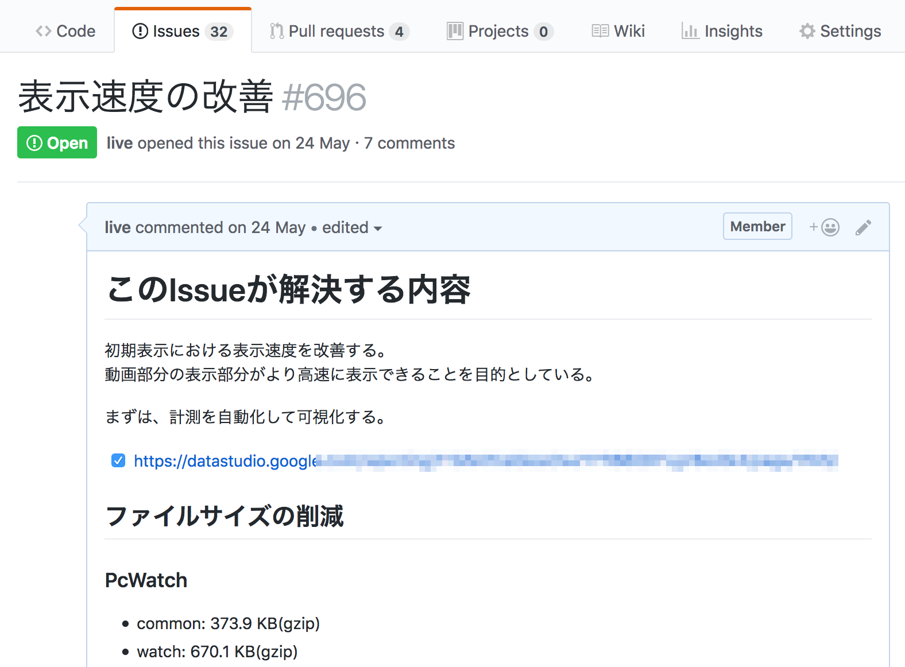

# ページ表示速度の改善

[視聴中のパフォーマンス改善](../watching)（ランタイム）が一段落し、次はページロードを改善する作業にとりかかろうとしました。

ランタイムのパフォーマンス計測に比べて、ページロードのパフォーマンス計測は、計測手法や改善方法がある程度体系化されています。
一方でページロードの時間を継続的に改善する/維持するには仕組みが必要です。

また今回のパフォーマンス改善も"目的"を決めてから改善に取りかかりました。
今回のページロードのパフォーマンス改善において決めた目的は次のとおりです。

----

## 目的

- 初期表示における表示速度を改善する
- 動画部分の表示がより高速に表示できることを目的とする

----

このような目的を立て現状の調査から行うことにしました。
その調査の中でJavaScriptとCSSどちらもにファイルサイズの問題を抱えていることがわかりました。
まずは初期表示に必要なファイルサイズを小さくするという点に絞って話をすすめていくことにしました。

また、これらのページ表示速度の改善といったパフォーマンス改善には基本的に終わりはありません。
そのため、改善中に何をしたかや何をしてないかを一覧できるMeta的なIssueを作成し、そこにIssueやPRへのリンクを集めるようにしました。
GitHubは自動的にクロスリファレンスとなるため、リンクを貼るだけでなにが行われたが一覧しやすくなります。

実際に改善作業を行う前に、まずそのファイルサイズの変化を計測する仕組みが必要です。
[WebPagetest](https://www.webpagetest.org/)を使って継続的にファイルサイズなどのパフォーマンスデータを集める仕組みを作ることからはじめました。

- [継続的なパフォーマンス計測](./stats/README.md)

その後、実際にさまざまなアプローチでファイルサイズを減らしていきました。

- [パッケージはBundleを配布しない](./reduce-bundle/README.md)
- ["module"フィールド対応](./module-field/README.md)
- [ファイルサイズを減らす](./reduce-size/README.md)

## 参考

最初に述べたように、[視聴中のパフォーマンス改善](../watching)（ランタイム）に比べて、ページロードのパフォーマンス改善はすでにさまざまな書籍や文書があります。
この文書もその中の一部に過ぎません。他の文書も参考にしてください。

- [thedaviddias/Front-End-Performance-Checklist: 🎮 The only Front-End Performance Checklist that runs faster than the others](https://github.com/thedaviddias/Front-End-Performance-Checklist)
- [超速！ Webページ速度改善ガイド ──使いやすさは「速さ」から始まる：書籍案内｜技術評論社](http://gihyo.jp/book/2017/978-4-7741-9400-4)
- [Using WebPageTest - O'Reilly Media](http://shop.oreilly.com/product/0636920033592.do)
- [High Performance Browser Networking (O'Reilly)](https://hpbn.co/)
- [Webフロントエンド ハイパフォーマンス チューニング｜技術評論社](http://gihyo.jp/book/2017/978-4-7741-8967-3)
- [Webpagetestから始める継続的パフォーマンス改善](http://azu.github.io/slide/2018/roppongijs/webpagetest-performance.html)