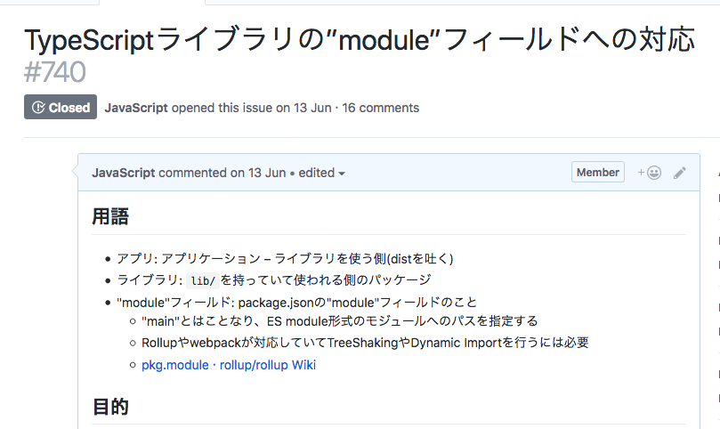
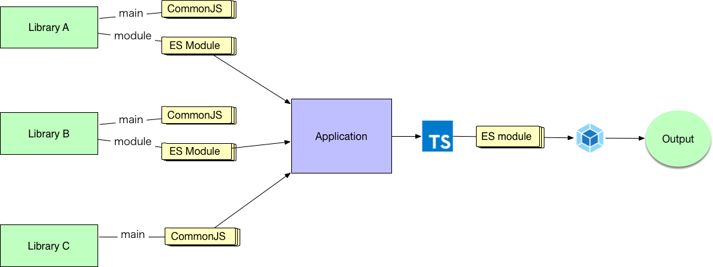

# "module"フィールド対応

[パッケージはBundleを配布しない](../reduce-bundle/README.md)で重複した依存ライブラリは削減できました。

## Tree Shaking

[webpack](https://webpack.js.org/)、[rollup.js](https://rollupjs.org)、[Parcel](https://parceljs.org/)といったBundlerでは[Tree shaking](https://en.wikipedia.org/wiki/Tree_shaking)と呼ばれる不要なコードを削除する仕組みを実装しています。

- [Tree Shaking](https://webpack.js.org/guides/tree-shaking/)
- [Reduce JavaScript Payloads with Tree Shaking  |  Web Fundamentals  |  Google Developers](https://developers.google.com/web/fundamentals/performance/optimizing-javascript/tree-shaking/)

Tree Shakingはモジュール間の構造を静的に解析して（副作用がない）不要なコードを削除する手法です。

Tree Shakingを行うには、モジュール間の依存関係を静的に解析できるようにしなければなりません。 CommonJSで広く使われている[require()](https://nodejs.org/api/modules.html#modules_require)と[module.exports](https://nodejs.org/api/modules.html#modules_module_exports)でのモジュール定義はただの関数とオブジェクトで定義であるため動的です。

動的とは実行してみなければそれがインポート/エクスポートできるかわからないものと言い換えられます。つまり、CommonJSでは次のような動的なインポートも問題ありません。

```js
let myModule;
try{
    myModule = require("./myModule");
}catch(error){
    myModule = "default value"
}
```

このように動的なインポート/エクスポートは実行してみなければわからないので、静的な解析を行いモジュール間の依存関係を分析するのが難しいです。

一方で、ES2015で構文として導入された`import`と`export`構文は実行する前に依存関係が分析できます。
なぜなら、`import`や`export`はトップレベルのスコープ（モジュールスコープ）の直下に記述しないとエラーとなる構文であり、静的に依存関係が解析できるように設計されています。

つまり、次のような記述は構文エラーとなります。

```js
let myModule;
try {
    import myModule from "./myModule";
}catch(error){
    myModule = "default value"
}
```

そのため、ほとんどのbundlerがTree Shakingの対象にできるのは`import`、`export`構文を使っているコードのみです。

簡単にまとめると、Tree Shakingを行うには`import`と`export`の構文のままコードを含めたライブラリとして公開する必要があります。
Tree Shakingによって使われてないコードを削除するなどで、ファイルサイズやJavaScriptのパース速度の改善できます。

- [JavaScript Start-up Optimization  |  Web Fundamentals  |  Google Developers](https://developers.google.com/web/fundamentals/performance/optimizing-content-efficiency/javascript-startup-optimization/)

Tree Shakingの詳細は次の記事でも解説されています。

- [2018 年の tree shaking | 株式会社カブク](https://www.kabuku.co.jp/developers/tree-shaking-in-2018)

## Tree Shakingに対応する

Tree Shakingに対応するには、そのライブラリが`import`、`export`構文で出力しているコードを持っていることをbundlerに伝える必要があります。
この通知方法は標準化されたものではないですが、多くのbundlerは`package.json`の`"module"`フィールドを参照します。

通常のnpmで配布しているライブラリは`"main"`フィールドにかかれているパスを読み込みます。
この`"main"`フィールドにかかれているファイルはCommonJSの`require`で読めるファイルとなります。

`"module"`フィールドに書くファイルパスは名前のとおり**ECMAScript モジュール**形式のコードで、このコードは`import`/`export`のままのコードを配置します。webpackなどのbundlerは`"module"`フィールドが存在する場合はそちらを優先して読み込みます。
（webpackではこの読み込む優先度を[resolve.mainFields](https://webpack.js.org/configuration/resolve/#resolve-mainfields)で変更できます）

そのため、管理しているライブラリそれぞれ`"module"`フィールドに対応する必要があります。
(`"module"`フィールドに対応してないライブラリは今までとおり扱えるので、無理にすべてを対応する必要はありません）

次のような内容でIssueを作成し、対応するべきモジュールを一個ずつ対応していきました。
（`"module"`フィールドは混在できるので、すべてを一気にやる必要はありません）

最終的には、この`"module"`フィールドの対応によってアプリのbundleのサイズは⬇️65kb（gzip）ほど削減できました。
内訳としては外部ファイル（chunk）にしたSVGが20kb（gzip）、Tree Shakingと[ModuleConcatenationPlugin](https://webpack.js.org/plugins/module-concatenation-plugin/)による削減が45kb（gzip）ほどでした。



**↓ここから先はすべて当時書いたIssueの内容です↓**

----

## 用語

- アプリ: アプリケーション – ライブラリを使う側（distを吐く）
- ライブラリ: `lib/`を持っていて使われる側のパッケージ
- "module"フィールド: package.jsonの"module"フィールドのこと
  - "main"とはことなり、ES module形式のモジュールへのパスを指定する
  - Rollupやwebpackが対応していてTreeShakingやDynamic Importを行うには必要
  - [pkg.module · rollup/rollup Wiki](https://github.com/rollup/rollup/wiki/pkg.module)

## 目的

- SVGロゴのReactコンポーネントを遅延ロードする（メインアプリのbundleからSVGを外す）
- webpackのbundleの最適化を有効化しファイルサイズやランタイムコストを小さくする
  - CommonJSは動的、ES Moduleは静的に解決される
  - この違いによりwebpackのTree ShakingやCode Splittingは、ライブラリ側でES Module形式の出力が必要となる（これは"module"フィールドに対応するということ）
  - [Tree Shaking](https://webpack.js.org/guides/tree-shaking/)
  - [Code Splitting](https://webpack.js.org/guides/code-splitting/)
  - [2018 年の tree shaking | 株式会社カブク](https://www.kabuku.co.jp/developers/tree-shaking-in-2018)

webpack 4からデフォルトの[ModuleConcatenationPlugin](https://webpack.js.org/plugins/module-concatenation-plugin/)の処理でランタイムのコストとファイルサイズが削減できる。
この最適化処理はES modulesのコードベースでないとできない。

- webpackのbundle時に、モジュールごとに安全のための無駄な即時実行関数によるスコープ作成が作成される
- モジュールの数が増えるほどコストが線形的に増えてしまう問題が発生してしまう
- [The cost of small modules | Read the Tea Leaves](https://nolanlawson.com/2016/08/15/the-cost-of-small-modules/) この問題が[ModuleConcatenationPlugin](https://webpack.js.org/plugins/module-concatenation-plugin/)相当の処理で軽減できる


## 必要なこと

各ライブラリ（使われる側）とアプリ側（使う側）でそれぞれES module形式のままwebpackにモジュールを渡せるようにする

最終的にこんな感じの構成になります。



- Library AやBは"module"フィールドに対応した例
- Library Cは"main"フィールドだけのCommonJsなライブラリが混ざっても問題ない
- ApplicationはTypeScriptではES module形式で出力して、最終的にはwebpack側でブラウザ向けに出力するのでES moduleがブラウザが読み込まれるわけではない

### ライブラリ側

次の2つに対応する必要があります

- "module" フィールドに対応
  - `package.json`に "module"フィールドの追加
  - ES module形式でのライブラリ公開
- "sideEffects" フィールドに対応
  - `"sideEffects": false`: ライブラリはpolyfillなどglobalに影響を与えるモジュールを含んでいない
  - `"sideEffects": true`: ライブラリはpolyfillなどglobalに影響を与えるモジュールを含んでいる
  - `sideEffects:false`の場合は不要なモジュールが消せる

#### "module" フィールドへの対応方法

TypeScriptを利用してい場合は次のようなtsconfig.jsonの"module"向けの設定を追加する

- lib向け: `tsconfig.json`
- module向け: `tsconfig.json`

`tsconfig.module.json`:
```json5
{
  "extends": "./tsconfig.json",
  "compilerOptions": {
    "target": "es5",    // <= module以外は通常通りES5相当の出力になる
    "module": "esnext", // <= "module"によってimport/exportのまま出力できる
    "moduleResolution": "node",
    "outDir": "./module" // <= 通常のlibとは異なる場所に出力する
  },
  "include": [
    "src/**/*"
  ],
  "exclude": [
    "node_modules"
  ]
}
```

ビルド時はそれぞれのtsconfig.jsonで`tsc`を使ったビルドすればよい。

```
tsc -p ./tsconfig.json && tsc -p ./tsconfig.module.json
```

📝  Note: tsconfig.jsonは複数の形式をサポートしてないため、２つの設定を用意して2種類のビルドを行う手法を取る。

- [Suggestion: tsconfig.json support multiple configurations. · Issue #11172 · Microsoft/TypeScript](https://github.com/Microsoft/TypeScript/issues/11172)

最後に`package.json`に"module"フィールドを追加する。
これでライブラリ側の"module"フィールド対応はひとまずできる

```json5
{
  "main": "lib/index.js", // <= ES5 + CommonJS
  "module": "module/index.js", // <= ES5 + ES module
  // ....
}
```

最終的には次のようなディレクトリ構造になる。


```
├── dist/
│      bundleしたファイル
├── lib/
│      src/ を JavaScript に変換したファイルと型定義ファイル
├── module/
│      src/ を JavaScript に変換したES module版と型定義ファイル
├── src/
│      TypeScriptのソースコード
```

#### "sideEffects" フィールドに対応

"sideEffects"フィールドに対応するとwebpackがさらに最適化できる。
詳細は[Tree Shaking](https://webpack.js.org/guides/tree-shaking/#mark-the-file-as-side-effect-free)にかかれている。
副作用（globalの挙動を書き換える）ものが明示されていれば、全く使ってないファイルを完全に消すことができる。デフォルトでは副作用があるかはわからないため、まったくつかってなくてもファイルを消すことができない。（importしただけで挙動を変更するモジュールがあるとだめになるため安全に倒す）

[2018 年の tree shaking | 株式会社カブク](https://www.kabuku.co.jp/developers/tree-shaking-in-2018)に実際の例が紹介されている。

- `"sideEffects": false`: ライブラリはpolyfillなどglobalに影響を与えるモジュールを含んでいない
- `"sideEffects": true`: ライブラリはpolyfillなどglobalに影響を与えるモジュールを含んでいる

に従った値を指定する。
特定のファイルだけ副作用があるという設定もできる。

```json
{
  "name": "your-project",
  "sideEffects": [
    "./src/some-side-effectful-file.js",
    "*.css"
  ]
}
```

副作用なしのモジュールは消える場合があるので、`css-loader`などでCSSがタグに対してスタイルを当てる（副作用がある）場合はCSSを副作用ありにしないといけない。

### アプリ側

#### `"module": "esnext"`への対応

利用する側もwebpackにはES Moduleのまま渡すようにする。

TypeScriptならばアプリ側の`tsconfig.json`も`"module": "esnext"`に対応する。
これでアプリ側のコードがES moduleとなりwebpackなどが最適化できる。

`tsconfig.json`:
```json5
{
  "compilerOptions": {
    // アプリ側なので他にもいろいろ設定があるはず
    // ... 省略 ...
    "target": "es5",    // <= module以外は通常通りES5相当の出力になる
    "module": "esnext", // <= "module"によってimport/exportのまま出力できる
    "moduleResolution": "node",
    "outDir": "./lib",
    // ... 省略 ...
  "include": [
    "src/**/*"
  ],
  "exclude": [
    "node_modules"
  ]
}
```

#### Code Splittingへの対応

ライブラリ側でDynamic Importをしていて、かつwebpack向けにマジックコメントを利用しておけば、
アプリ側でCode Splittingの対応するだけで動的ロードに対応できる。

```js
// lodashという`[name]`のchunkになる
import(/* webpackChunkName: "lodash" */ 'lodash').then(lodash => { /* * /})
```

- [Code Splitting](https://webpack.js.org/guides/code-splitting/)

アプリ側ではwebpack.config.jsで`chunkFilename`の対応を行えばよい。

```js
  const path = require('path');

  module.exports = {
    mode: 'development',
    entry: {
       index: './src/index.js'
    },
    output: {
      filename: '[name].bundle.js',
      // ライブラリ側のDynamic Importもchunkに吐き出せる
      chunkFilename: '[name].chunk.js',
      path: path.resolve(__dirname, 'dist')
    },
  };
```

`chunkFilename`が指定されていれば、次のように書いた"lodash"モジュールは`lodash.chunk.js`というファイルに分割して出力され、実行時に動的ロードされる。

```js
// lodashという`[name].chunk.js`のchunkファイルが作成される
import(/* webpackChunkName: "lodash" */ 'lodash').then(lodash => { /* * /})
```

#### chunkのファイル名 

ライブラリ側では読み込むchunkを`import(/* webpackChunkName: "ファイル名" */ "module")`というマジックコメントで指定する必要がある。

- [Code Splitting](https://webpack.js.org/guides/code-splitting/)
- [Module Methods](https://webpack.js.org/api/module-methods/#import-)を参照

この`ファイル名`は必ずしもユニークである必要はないが、chunkとして分けたときにわかりやすい名前（URL）になるのを想定して決めること。

実際にchunkファイルを生成する側の設定で、出力するファイル名規則を設定できる。
次のようにchunkファイルのハッシュ値をファイル名に入れることができるため、ファイル名自体は被った際にも、別ファイルとして出力できる。

```
chunkFilename: 'scripts/chunk.[name].[chunkhash:10].js'
```

読み込むファイル名を `webpackChunkName` に指定すれば大きな問題はなさそう。

#### publicPathの設定

webpackでビルドする際に`publicPath`にあたる情報が適切に設定されていない、Dynamic Importしたファイルが意図しないURLを参照してしまう問題。
(chunkに分離はできたけど、`import("./chunk.js")` がNot foundとなってしまうようなケース)

次のようにbundle.jsから`import("./chunk.js")` を読み込む場合に、`publicPath`をベースとして相対パス(`./chunk.js`)を読み込む。
そのため、次のようにウェブページのURLとJavaScriptファイルを置くCDNのドメインが異なる場合などは、`bundle.js`から`./chunk.js`を読み込むことができない。

ウェブサイトとCDNでドメインが異なる場合の例:

- `https://example.com/`
   - `<script src="https://cdn.example.com/bundle.js"></script>`
- `https://cdn.example.com/bundle.js`
   -  `import("./chunk.js")` -> `https://example.com/chunk.js` は 404になる
- `https://cdn.example.com/chunk.js`

この場合、`publicPath`に当たる情報には `https://cdn.example.com/` が指定されていないと、
`./chunk.js` を `https://cdn.example.com/chunk.js` として解釈できずにDynamic Importは失敗してしまう。

[Public Path](https://webpack.js.org/guides/public-path/)にかかれているように次の2つのどちらかを使って、`publicPath`の値を指定する。

- コンパイル時に、`publicPath` に CNDのAssertまでのパスを指定する
- 実行時に、 `__webpack_public_path__` へCNDのAssertまでのパスを指定する

すでにアプリ側で実行時にAssetまでのパスを持っているなら、必ず通る場所に`__webpack_public_path__`の代入を行うが手早い。
(`publicPath`はいろいろな環境に分岐するには、webpack.configで分岐を書く必要がでてくるため)

```js
__webpack_public_path__ = assertBaseURL
```

先程の例ならば次のように指定されていれば、Dynamic Importでchunkを読み込むことができる。

```js
__webpack_public_path__ = "https://cdn.example.com/"
```

## FAQ

よくある質問集

### Dynamic Importをchunkにしたくない場合

"module"対応したライブラリを利用していて、かつそれをラップしたライブラリをbundleとして配布したい場合について（ライブラリでbundle版を配布したい場合）

tl;dr: `LimitChunkCountPlugin`プラグインを使うとwebpackはchunkを勝手にわけない

`import()`を使っているライブラリがあるとwebpackは自動的にそれをchunkに分けて出力する。
（moduleで対応しているとDynamic Importが認識されるのでchunkに分ける）

bundleしたライブラリ（Dynamic Importなし）として配布したい場合は、`LimitChunkCountPlugin`を使うことでchunkへの分離を抑制できる。

```js
  new webpack.optimize.LimitChunkCountPlugin({
    maxChunks: 1
  })
```

- [How to disable Code Splitting in webpack – Glenn Reyes – Medium](https://medium.com/@glennreyes/how-to-disable-code-splitting-in-webpack-1c0b1754a3c5)

### "module"対応したライブラリを使いたくない場合

"module"フィールド（ES Modules）ではなく今までと同じ"main"フィールド（CommonJS）としてライブラリを使いたい場合について。

tl;dr: `mainFields: ["main"]`を指定する

webpackの[resolve.mainFields](https://webpack.js.org/configuration/resolve/#resolve-mainfields)を設定することで、ライブラリのどのフィールドを優先的に使うか（ES ModulesかCommonJSか）をアプリ側で指定できます。

デフォルトでは、次のように `module`（ES modules）> `main`（CommonJS）の優先度に指定されています。

```js
    resolve: {
        mainFields: ['browser', 'module', 'main'],
        // 他の設定
    },
```

次のように `main`（CommonJS）のみに指定をすれば、ライブラリが"module"フィールドに対応していた場合でも、"main"フィールドを利用するように設定できます。

```js
    resolve: {
        // module フィールドは使わない
        mainFields: ['main'],
        // 他の設定
    },
```


----
