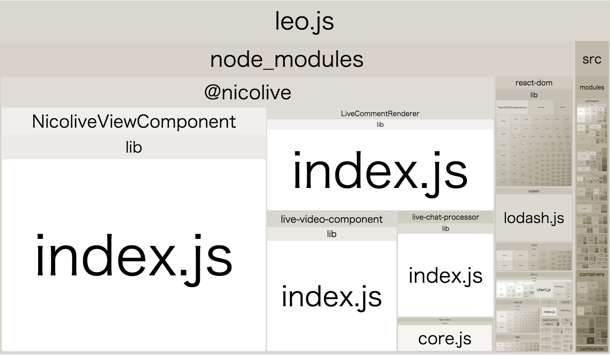

# パッケージはBundleを配布しない

ニコニコ生放送 PCのHTML5プレイヤーは、基本的にはTypeScriptで書かれていてビルドにはwebpack + tsloaderという構造になっています。

webpackでビルドされているので[Webpack Bundle Analyzer](https://github.com/webpack-contrib/webpack-bundle-analyzer "Webpack Bundle Analyzer")を使い、ビルドしたパッケージの依存をビジュアライズして調査しました。

- [Webpack Bundle Analyzer](https://github.com/webpack-contrib/webpack-bundle-analyzer "Webpack Bundle Analyzer")

実際の改善前のbundleしたファイルの構造は次のような形でした。



`@nicolive`から始まるものは社内のnpmレジストリに公開されている社内モジュールです。
この社内モジュールが`lib/index.js`という大きな1つファイルしか持っていないことがわかります。

これは、各パッケージがbundle済みのファイルを`lib/index.js`として配布するようになっていたためです。また、そのbundle済みファイルを`package.json`の`main`に指定していたため、単純に`require`などをするとbundle済みファイルがよみこまれるようになっていました

## Bundle済みのファイルだけを配布する問題

パッケージがbundle済みのファイルだけを配布するメリットとデメリットは次のようになります。

**メリット**

- ライブラリ側にビルドしないと使えない特殊な仕組みがある場合に、使う側が何も考えずに利用できる
    - 例) [hls.js](https://github.com/video-dev/hls.js)は内部的にWeb Workerを使うためbundle済みファイルを配布をしている
- Direct require(`require("module/lib")`)で非公開なファイルを参照されるのを防げる
    - [React v16.0](https://reactjs.org/blog/2017/09/26/react-v16.0.html)ではRollupで最適化したbundle済みファイルを配布することで`react/lib/*`への参照を防いでいます
    
**デメリット**

- ライブラリ側が依存しているモジュールもbundleに含まれてしまう
    - たとえば、ライブラリが`lodash`を使っている場合に、bundleにも`lodash`が含まれてします
    - ライブラリを使う側も`lodash`を使っている場合は、重複して`lodash`が入ってしまう
- ライブラリを使う側でより積極的な最適化が行えない
    - bundle済みのファイルを配布するということは、ES5へ変換済みのコードを配布するということになる
    - [Tree Shaking](https://webpack.js.org/guides/tree-shaking/)のようなアプリとライブラリを含めた全体で最適化するビルドが適応できなくなる

実際には、ライブラリはbundle済みのファイルとTypeScriptをJavaScriptに変換しただけのファイルの2種類を同時に配布できます。

今回の調査でライブラリ`lodash`が使われていたものが複数あり、
その結果、複数の`lodash`がアプリに含まれていました(`lodash`は1つ20kb gzip)。

この問題を解消するために、ライブラリはそれぞれ二種類のファイルを出力するように修正しました。

- bundle済みのファイルを `dist/` へ
- tscで変換したファイルを `lib/` へ


**Before**:

```
├── lib/
│      bundleしたファイル
├── src/
│      TypeScriptのソースコード
```

**After**:

```
├── dist/
│      bundleしたファイル
├── lib/
│      src/をJavaScriptに変換したファイル
├── src/
│      TypeScriptのソースコード
```

これによって、ライブラリの利用者側でbundle済みか`lib/`したのファイルを使うが選択できるようになりました。

- 開発時は`src/`次のソースコードを編集する
- ライブラリとして使う場合はJavaScriptに変換済みの`lib/`が参照される
- scriptタグなどで読み込む場合は`dist/`のUMDへbundle済みファイルを直接利用する

この作業を社内に公開してるモジュールにそれぞれ適応しました。

## 計測

それぞれのライブラリがbundle済みではなくなったので、各ライブラリで重複したモジュールがなくなりました。
最終的にすべてをbundleしたJavaScriptのファイルサイズが小さくなることが確認できました。

- 2.7Mb -> 2.4Mb（gzipしてない状態）
- 765kb -> 681kb（gzip）

## 参考

- [rstacruz/webpack-tricks: Tips and tricks in using Webpack](https://github.com/rstacruz/webpack-tricks "rstacruz/webpack-tricks: Tips and tricks in using Webpack")
- [th0r/webpack-bundle-analyzer: Webpack plugin and CLI utility that represents bundle content as convenient interactive zoomable treemap](https://github.com/webpack-contrib/webpack-bundle-analyzer)
- [Webpack & React Performance in 16+ Steps](https://www.slideshare.net/grgur/webpack-react-performance-in-16-steps)
- [JavaScriptライブラリ/プロジェクトのファイルサイズの問題点を見つける方法 - Qiita](https://qiita.com/azu/items/7b54d614dc816780034a)
- [Webpackバンドルを占めるサイズがでかい奴を探す方法 - Qiita](https://qiita.com/wadahiro/items/c633e4c7c44154238397)
