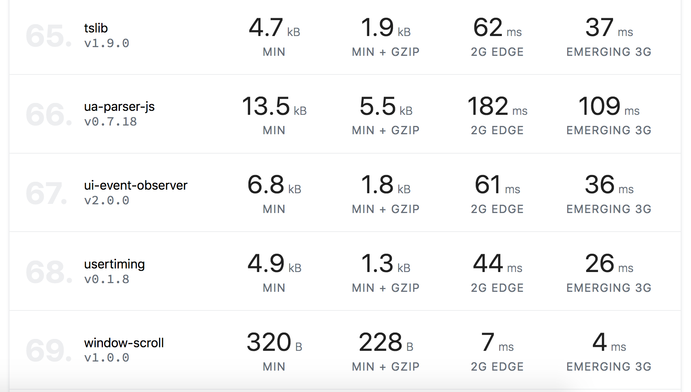
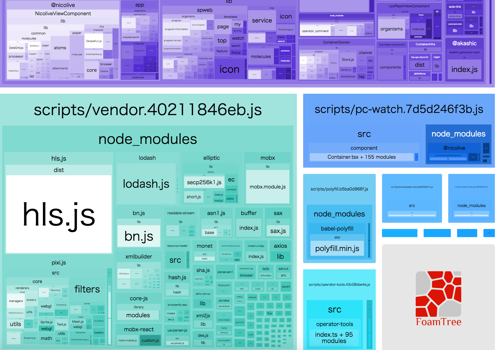
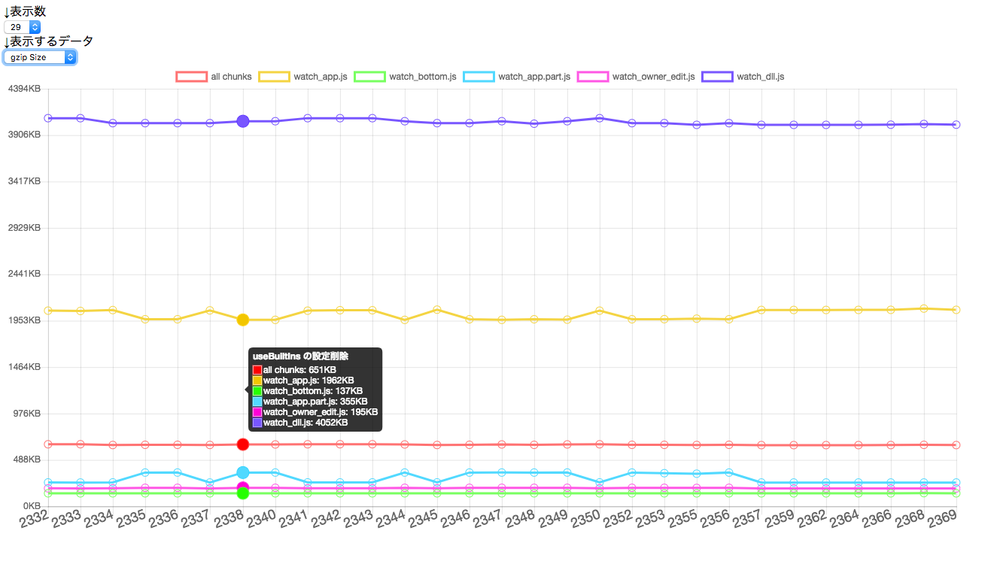
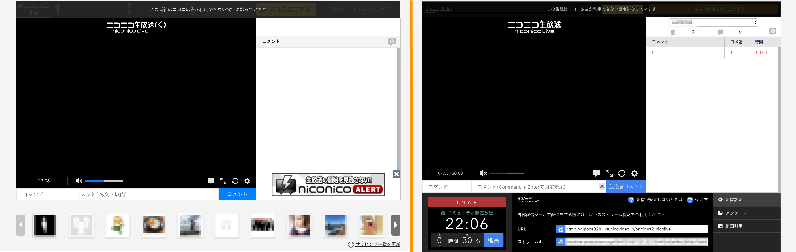
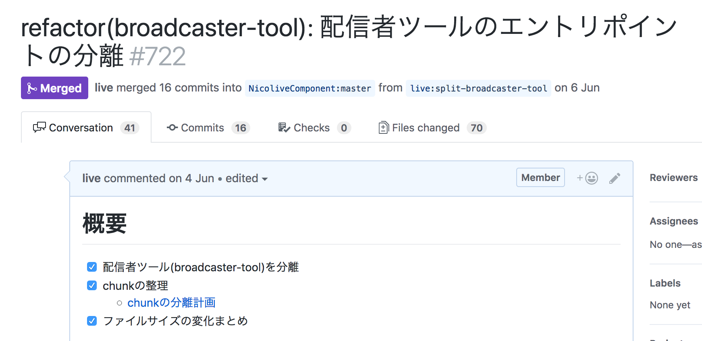

# ファイルサイズを減らす

ページロードを早くすることにおいてファイルサイズを小さくすることは重要です。
特にJavaScriptのようなパースやコンパイルといった処理を必要するスクリプトのファイルサイズを減らすことは、
そのまま処理コストにも影響します。

次の記事でもあるように同じサイズのJavaScriptと画像は同じコストではありません。

- [The Cost Of JavaScript In 2018 – Addy Osmani – Medium](https://medium.com/@addyosmani/the-cost-of-javascript-in-2018-7d8950fbb5d4)

しかしながら、ファイルサイズを小さくするにはアプリケーションによってさまざまなパターンが考えられます。
ここではいくつかのアプローチについて見ていきます。

## Bundleを分析する

これは単純ですがWebpackなどでbundleしたJavaScriptファイルを分析するというアプローチです。
ここで見つける問題としては意図せずに入ってしまっているライブラリ、想像より大きなライブラリなど含まれていないかです。

特定のライブラリのサイズを見るには[package-size](https://github.com/egoist/package-size)や[bundlephobia](https://bundlephobia.com/)などを使い、そのライブラリの依存を含めてサイズを見ます。
そのライブラリ自体のコード量ではなく、必ずbundleしてminifyしたgzipのサイズなどで比較します。
なぜなら、ライブラリ自体のサイズにはコメントなど圧縮すると大きくサイズが変わるものや、ライブラリのコードは少なくても依存してるライブラリのサイズが大きいという問題があるためです。

[](https://bundlephobia.com/scan)

> [bundlephobia.com/scan](https://bundlephobia.com/scan)で`pacakge.json`に書かれたライブラリのサイズを一覧

すでにアプリケーションのコードをWebpackでbundleしている場合は[webpack-bundle-analyzer](https://github.com/webpack-contrib/webpack-bundle-analyzer)を使うとサイズがわかりやすく可視化できます。



> webpack-bundle-analyzerでモジュールのサイズを可視化した例

[webpack-bundle-analyzer](https://github.com/webpack-contrib/webpack-bundle-analyzer)などは、環境変数などで普段のビルド + bundle-analyzerの結果を出力できるようにwebpackの設定ファイルを作成しておくとよいです。


例) `BUILD_STATS=1 webpack` のように環境変数で[webpack-bundle-analyzer](https://github.com/webpack-contrib/webpack-bundle-analyzer)を有効化する

```js
const path = require('path');
const webpack = require('webpack');
const BundleAnalyzerPlugin = require('webpack-bundle-analyzer').BundleAnalyzerPlugin;
const BUILD_STATS = !!process.env.BUILD_STATS;
module.exports = {
    // ...省略...
    plugins: [].concat(
      BUILD_STATS
       ? [
        new BundleAnalyzerPlugin({
          analyzerMode: 'static',
          reportFilename: path.join(__dirname, './build/stats/app.html'),
          defaultSizes: 'gzip',
          openAnalyzer: false,
          generateStatsFile: true,
          statsFilename: path.join(__dirname, './build/stats/app.json'),
          statsOptions: null,
          logLevel: 'info'
        })
      ]
      : []
      )
    )
    .concat([
      new webpack.ContextReplacementPlugin(/moment[\\/]locale$/, /^\.\/(ja)$/),
      new LodashModuleReplacementPlugin({ shorthands: true })
    ])

}
```

[webpack-bundle-analyzer](https://github.com/webpack-contrib/webpack-bundle-analyzer)を使った分析とファイルサイズの削減については、次の記事を参照するとよいでしょう。
コードをminifyするといった基本的なことからmomentのようなよくある大きなライブラリの扱い方に、より高度なファイルサイズの削減方法などについて書かれています。

- [Put Your Webpack Bundle On A Diet - Part 1](https://www.contentful.com/blog/2017/10/10/put-your-webpack-on-a-diet-part-1/)
- [Put Your Webpack Bundle On A Diet - Part 2](https://www.contentful.com/blog/2017/10/19/put-your-webpack-bundle-on-a-diet-part-2/)
- [Put Your Webpack Bundle On A Diet - Part 3](https://www.contentful.com/blog/2017/10/27/put-your-webpack-bundle-on-a-diet-part-3/)
- [Put Your Webpack Bundle On A Diet - Part 4](https://www.contentful.com/blog/2017/11/13/put-your-webpack-bundle-on-a-diet-part-4/)

より小さなライブラリに変更してサイズをへらすことも重要ですが、まずは使ってないライブラリや不用意に入ってしまっているものを取り除くことから始めるのがよいです。

例) よくある問題

- 意図せずに含まれているライブラリを取り除く
- 異なるバージョンが複数含まれているのを1つに統一する
    - [duplicate-package-checker-webpack-plugin](https://github.com/darrenscerri/duplicate-package-checker-webpack-plugin)
- momentの不要なロケールを取り除く
    - [moment-locales-webpack-plugin](https://github.com/iamakulov/moment-locales-webpack-plugin)
- lodashで未使用なメソッドを取り除く
    - [lodash-webpack-plugin](https://github.com/lodash/lodash-webpack-plugin)

アプリケーションのサイズ（特にJavaScript）はライブラリによって大きく増減します。
そのため、突発的なファイルサイズの増加を防ぐためにも[bundlesize](https://github.com/siddharthkp/bundlesize)のようなファイルサイズチェックをPRごとに行ったり、[size-plugin](https://github.com/GoogleChromeLabs/size-plugin)で現在のファイルサイズをビルド時に可視化するといった工夫も必要になります。

ファイルサイズの変化をどのように検知するかはいろいろなトレードオフがあるので、チームにあったものを選択するのがいいと思います。

たとえば、あるチームではPRごとに[webpack-bundle-analyzer](https://github.com/webpack-contrib/webpack-bundle-analyzer)の結果をグラフとして見られるようにして、ファイルサイズの変化を見ていました。



もちろん[合成モニタリングサービスを使った計測](../stats/README.md)も併用します。
しかし、外部からの監視は実際にデプロイするまでわからないため、このようなPRやコミットなど複数のレイヤーでチェックを併用します。
併用して自動チェックできるレイヤーを増やすことで問題に早く気づくことができるようになります。

## 初期表示に必要ないものを遅延ロードする

もっと単純で効果があるアプローチは、必要がないものは読み込まないことです。
注意しないと初期表示に不要なJavaScriptやCSSを含んでしまう場面も多いと思います。

これは特にサードパーティスクリプトの読み込みなどが該当しやすいです。
JavaScriptなら`async`属性を付けて遅延ロードさせ、[loadCSS](https://github.com/filamentgroup/loadCSS)などを使って遅延ロードさせるという手法が利用できます。

```diff
- <script src="https://example.com/script.js" />,
+ <script src="https://example.com/script.js" async defer />,
```


- [レンダリングを妨げる JavaScript を削除する  |  PageSpeed Insights  |  Google Developers](https://developers.google.com/speed/docs/insights/BlockingJS)
- [クリティカル リクエスト チェーン  |  Tools for Web Developers  |  Google Developers](https://developers.google.com/web/tools/lighthouse/audits/critical-request-chains?hl=ja)
- [Modern Asynchronous CSS Loading | Filament Group, Inc., Boston, MA](https://www.filamentgroup.com/lab/async-css.html)

特定のコンポーネントに紐付いて必要となるスクリプトなども、そのコンポーネントが表示されるまで読み込む必要がないはずです。
これは、広告のスクリプトやSNSボタンなど特定のコンポーネントに紐付くものなどが該当します。

これらのコンポーネントに紐づくスクリプトなどは、動的にロードしてそれが読み終わったタイミングでコンポーネントを更新するといった作りにすることで遅延ロードできます。

次のコードは、動的にスクリプトをロードするUtilと、スクリプトをロードするReactコンポーネントの例です。

`ScriptLoaderUtil.ts`:
```ts
/**
 * <script>タグでjsファイルを動的にロードするUtil
 */
export class ScriptLoaderUtil {
  /**
   * すでに読み込みを開始したURLを保持しておくマップオブジェクト
   */
  private static srcMap: { [src: string]: Promise<void> } = {};

  /**
   * デフォルトのタイムアウト(ミリ秒)
   */
  public static DEFAULT_TIMEOUT = 5 * 1000;

  /**
   * scriptタグを利用して外部ソースの読み込みを行う
   * @param src 読み込むjsのURL
   * @param timeout タイムアウト(ミリ秒)
   */
  public static load({ src, timeout }: { src: string; timeout?: number }): Promise<void> {
    return new Promise((resolve, reject) => {
      // すでに読み込みを開始している場合は2重に読み込まない
      if (this.srcMap[src]) {
        return this.srcMap[src].then(resolve);
      }
      // 新規 src の場合は script タグを利用して読み込みを開始する
      this.srcMap[src] = new Promise((resolve, reject) => {
        let isHandled = false;
        const script = document.createElement('script');
        script.src = src;
        script.type = 'text/javascript';
        script.charset = 'utf-8';
        script.async = true;
        /* tslint:disable */
        const onLoad = () => {
          isHandled = true;
          resolve();
          script.removeEventListener('load', onLoad);
          script.removeEventListener('error', onError);
        };
        const onError = () => {
          isHandled = true;
          reject(new URIError(`The script(${src}) is not accessible.`));
          script.removeEventListener('load', onLoad);
          script.removeEventListener('error', onError);
          delete this.srcMap[src];
        };
        /* tslint:enable */
        script.addEventListener('load', onLoad);
        script.addEventListener('error', onError);
        document.body.appendChild(script);
        // タイムアウト処理
        setTimeout(() => {
          if (isHandled) {
            return;
          }
          script.removeEventListener('load', onLoad);
          script.removeEventListener('error', onError);
          delete this.srcMap[src];
          reject(new Error(`The script(${src}) load is timeout`));
        }, timeout || this.DEFAULT_TIMEOUT);
      });
      return this.srcMap[src].then(resolve, reject);
    });
  }
}
```

`ScriptLoader.tsx`:
```ts
import * as React from 'react';
import classNames from 'classnames';
import { ScriptLoaderUtil } from './ScriptLoaderUtil';

export type ScriptLoaderProps = {
  src: string;
  className?: string;
  onLoad?: () => void;
  onError?: (error: Error) => void;
};

/**
 * <script> で JS ファイルを読み込むコンポーネント
 * <ScriptLoader src="https://example.com/script.js" onLoad={() => {}} />
 */
export default class ScriptLoader extends React.PureComponent<ScriptLoaderProps> {
  public componentDidMount() {
    ScriptLoaderUtil.load({
      src: this.props.src
    })
      .then(() => {
        this.props.onLoad && this.props.onLoad();
      })
      .catch(error => {
        if (this.props.onError) {
          this.props.onError(error);
        } else {
          console.error(error);
        }
      });
  }

  public render() {
    return <div className={classNames('ScriptLoader', this.props.className)} />;
  }
}
```

## 分離と自動チェック

webpackなどでは[Code Splitting](https://webpack.js.org/guides/code-splitting/)で初期表示に必要ないものをbundleから別のchunkに分割できます。

- [Code Splitting](https://webpack.js.org/guides/code-splitting/)
- [Code-Splitting – React](https://reactjs.org/docs/code-splitting.html)

これによって、初期表示に必要なbundleのファイルサイズを削減できます。

どのように分割するかはアプリケーションに依存しますが、もっとよくあるケースはルーティングによってページ（URL）として別れているコンポーネントを分割することです。
また、同じページ内でも一般ユーザーと管理ユーザーで表示されるものが異なるということがあります。
管理ユーザーでは"一般ユーザーの表示" + "管理ツール"といった構造になっていることも多いです。

このような場合にメインのbundleに一般ユーザーに不要な"管理ツール"のコンポーネントを含めるのは適切ではありません。
そのため、"管理ツール"だけをchunkとして分けたり、[Dynamic Imports](https://webpack.js.org/guides/code-splitting/#dynamic-imports)で動的にロードするといったことができます。

具体的な例として、ニコニコ生放送では視聴者がみる視聴ページと配信者が見る配信ページはほとんど同じJavaScriptで動作しています。
しかし、配信者が見るページには、視聴者見るプレイヤーなどに加えて配信者向けのツール（コンポーネント）が追加されています。



> 左は視聴者が見るページ、右は配信者が見るページ

この"配信者向けのツール"は視聴者に不要であるためメインのbundleから外す必要ことでファイルサイズが削減できます。

実際にこの"配信者向けのツール"を、メインのbundleから配信者向けのツールだけのchunk（ファイル）へと分離しました。
これによってメインのbundleが"配信者向けのツール"の分である30kb（gzip）程度削減できました。



この変更では、次のようにイメージで利用できるように分離されました。

```
<script src="main.bundle.js">
if (配信者ページなら) { 
    <script src="配信者向けツールのbundle.js">
}
```

**bundleの再結合の防止**

Bundleを分離することはうまくできても、その状態を維持する必要があります。
たとえば、先ほどの"配信者向けのツール"の分離では、ディレクトリも次のように分離していました。
そしてそれぞれに対応するbundleとchunkを出力するようになっています。

```
src/
├── broadcaster-tool(配信者向けのツールのコード) ---> broadcaster-tool.jsとして出力
└── view(視聴者向けのコード)  ---> pc-watch.jsとして出力
```

これがうまく分離されるには`view(視聴者向けのコード) ` と `broadcaster-tool(配信者向けのツールのコード)` の間に依存関係を作らない必要があります。
なぜなら、`view`が`broadcaster-tool`に依存関係があるとwebpackなどはchunkとして分離できなくなるためです。
たとえば、`view(視聴者向けのコード) `から`broadcaster-tool(配信者向けのツールのコード)` に依存がある`pc-watch.js`に`broadcaster-tool.js`の内容が含まれてしまいます。

これは、JetBrains系のIDEやVSCodeなどJavaScriptのモジュールへのパス補完が簡単できるといつの間にか起きてしまうことがあります。
コンポーネント名を入力すると、自動的にそのコンポーネントを`import`してしまって想定外の依存関係が発生すると言ったことがおきます。

このような意図しない方向の依存を防止するには[dependency-cruiser](https://github.com/sverweij/dependency-cruiser)のようなチェックツールを使うのが簡単です。`dependency-cruiser`はルールを書いて、モジュールの依存関係のチェックを行えます。

- [sverweij/dependency-cruiser: Validate and visualize dependencies. With your rules. JavaScript, TypeScript, CoffeeScript. ES6, CommonJS, AMD.](https://github.com/sverweij/dependency-cruiser)

具体的には、次のようなルールを書くと`src/broadcaster-tool` -> `src/view` への参照を自動的にチェックして、意図しない参照を防止しています。

```yaml
{
    "forbidden": [
        {
            "name": "broadcaster-tool-does-not-import-view-index",
            "comment": "broadcaster-toolはview/index.tsを参照するとcode splitできなくなる。分割したbroadcaster-toolにview/index.tsから参照するすべてのファイルが含まれてしまうのを避けるため、直接view以下のファイルを参照してください",
            "severity": "error",
            "from": {
                "path": "^src/broadcaster-tool"
            },
            "to": {
                "path": "^src/view"
            }
        }
    ],
    "options": {
        "doNotFollow": "node_modules"
    }
}
```

## 類似サービスと比較する

ファイルサイズは大きくても動かなくなるわけではないのため、どこに原因があるかがわかりにくいという問題があります。
そのときの判断材料として、類似するサービスと比較して見る方法があります。
([SpeedCurve](https://speedcurve.com/)などではCompetitorのURLと一緒に計測して、結果を比較といった方法もできます。)

たとえば、ニコニコ生放送ならばニコニコ動画、Youtube、FRESHLIVEなど類似する機能をもつサービスはいろいろあります。
それらのサイトと比較のファイルサイズを比較して、問題を見つけるというのも1つの手段です。

JavaScriptのサイズはもつ機能や作りによって大きな差はでます。
一方、CSSは画面を構成する要素に依存しまた想定する画面サイズにはそこまで差はでないため、大きな差が出にくいとも考えられます。

ニコニコ生放送の視聴ページのCSSを他のサイト比較してみると、なぜか3倍程度大きいという問題ことがわかりました。
CSSが大きくなっている原因を次のツールなどで調べてみると、いくつかの問題があるということがわかりました。

- [TestMyCSS | Optimize and Check CSS Performance](http://www.testmycss.com/)
- [CSS Stats](https://cssstats.com/)

具体的に見つかった問題は次のとおりです。

- Base64 Lengthがでかい（Base 64のサイズが大きい）
    - 前者はCSSに画像やfontがBase64でそのまま埋め込まれていた
- Empty Rulesの数が多い（空のセレクタにコメントだけが残っている問題があった）

これらの問題に対してそれぞれ次のような解決方法を取りました。

- 画像やfontなどのリソースをBase 64ではなくURLとして指定するようにした
    - fontは実際に使用されるまでダウンロードされなくなった
- cssnanoの[discardComments](https://cssnano.co/optimisations/discardcomments/)ルールを適用してコメントを消して、minifyで空セレクタがきえるようにした

CSSはSassやPostCSSなどのさまざまなツールを経由して出力されることが多いため、不用意にサイズが増えてしまっていることがあります。
そのため、[Performance budgets](https://speedcurve.com/blog/performance-budgets-in-action/)を設定するなど不自然な増え方をした場合に気づく仕組みが必要になるでしょう。
