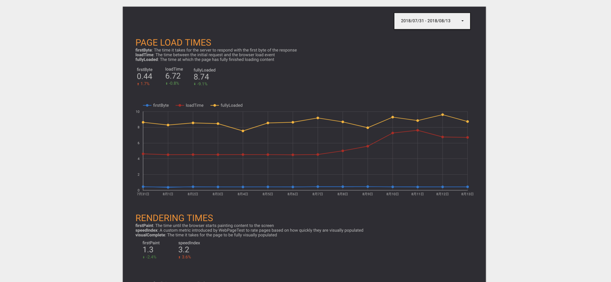
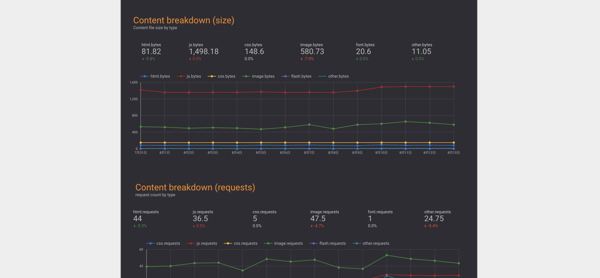

# 計測

ページロードのパフォーマンスを計測については、すでに多くのツールやサービスが存在します。

以下はパフォーマンス計測を行えるサービスの例です。

- [WebPagetest](https://www.webpagetest.org/)（無料）
- [SpeedCurve](https://speedcurve.com)（有料）
- [Calibre](https://calibreapp.com/)（有料）
- [New Relic Synthetics](https://newrelic.com/products/synthetics)（有料）
- [CatchPoint](https://www.catchpoint.com/)（有料）

今回の対象のサイトはログインが必須であったことと、とりあえずないよりはあったほうがいいという考えであったため、
手軽に使える[WebPagetest](https://www.webpagetest.org/)で計測を行うことにしました。
（環境によって左右されにくいファイルサイズをメインとしてのも理由の1つです）

## [WebPagetest](https://www.webpagetest.org/)

[WebPagetest](https://www.webpagetest.org/)はOSSとして公開されていてプライベートインスタンスを立てることもできます。
また、ホスティング版では制限はありますが、API経由でパフォーマンス計測を行いその結果を取得できます。
しかし、他のサービスのように結果を連続して見られるダッシュボードのような機能はありません。

[Sitespeed.io](https://www.sitespeed.io/)のようなWebPagetestと連携できるパフォーマンスモニタリングツールもあります。

今回は別途サーバなどを用意せずに簡単に導入できる[Google Apps Script](https://developers.google.com/apps-script/)を使い、[Google Spreadsheet](https://www.google.com/intl/ja_jp/sheets/about/)に結果を記録し、[Google DataStudio](https://datastudio.google.com/overview)で結果を見るダッシュボードを作るという方法を取りました。

実際に利用したものは次にリポジトリに公開されている[Google Apps Script](https://developers.google.com/apps-script/)です。
これを利用することで30分に1回程度計測を行い、その結果をSpreadSheetに記録して、[Google DataStudio](https://datastudio.google.com/overview)で見られる環境を作成しました。

Googleアカウントのみで完結して、Cron的な仕組みも[Google Apps Script](https://developers.google.com/apps-script/)で行えるので値を記録するだけならシンプルです。

- [uknmr/gas-webpagetest](https://github.com/uknmr/gas-webpagetest)
- [DataStudioとGASでWebPagetestの計測結果をグラフ化する | mediba Creator × Engineer Blog](https://ceblog.mediba.jp/post/154874126622/datastudio%E3%81%A8gas%E3%81%A7webpagetest%E3%81%AE%E8%A8%88%E6%B8%AC%E7%B5%90%E6%9E%9C%E3%82%92%E3%82%B0%E3%83%A9%E3%83%95%E5%8C%96%E3%81%99%E3%82%8B)

[Google DataStudio](https://datastudio.google.com/overview)を使うことでSpreadSheetなどのデータ元にそれを可視化するダッシュボードを作成できます。
これでWebPagetestで特定のページを計測して、そのページのロード時間やコンテンツ（HTML, JS, CSSなど）のサイズを継続的に監視できるようになりました。

## 経過を監視する

これらの方法でパフォーマンス計測を行うことには主に2つの意味があります。

1. パフォーマンス改善を行い、その結果を外部から観測して確認する
2. パフォーマンス改善以外の変更で、パフォーマンスが落ちてないかを検知する

どちらもパフォーマンスに関する値を継続的に取ることで、その連続性から変化に気づくことができます。

ファイルサイズなどの値としてはっきりしているものならば、修正を反映するたびに[Chrome DevTools](https://developers.google.com/web/tools/chrome-devtools/)などで確認することもできますが、手動で行うには大変です。
また、パフォーマンスに関係しない機能の追加などをした際に思わぬところで、パフォーマンスへ悪影響を与える場合があります。
そのような問題に気づくためにも、継続的にパフォーマンスを計測することは必要です。

## 参考

- [Webpagetestから始める継続的パフォーマンス改善](http://azu.github.io/slide/2018/roppongijs/webpagetest-performance.html)