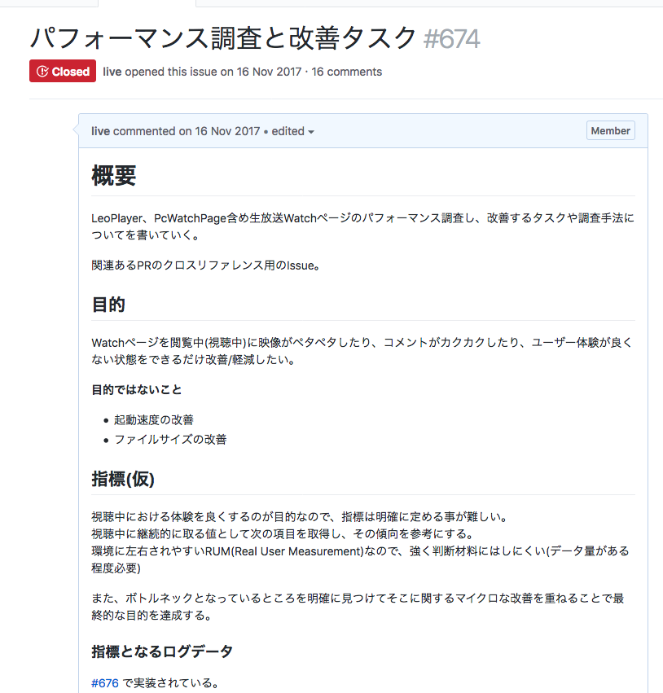

# 

パフォーマンス改善や何をするに当たっても目的（方向）と指標がないと、解決しようとしたものごとが本当に解決できたのかわからずに終わってしまう問題があります。

そのため、まず最初に今回のパフォーマンス改善は何を目的にしているのかをはっきりさせることから開始しました。
実際に定めた目的は次のとおりです。

----

## 目的

視聴ページを閲覧中（視聴中）に映像がペタペタしたり、コメントがカクカクしたり、ユーザー体験が良くない状態をできるだけ改善/軽減したい。

**目的ではないこと**

- ページロードの改善
- ファイルサイズの改善

----

視聴ページの例

> 視聴ページ: 実際に生放送の映像を閲覧するページのこと

目的では、生放送の映像を視聴中の動作を安定化することを目的としました。
このパフォーマンス改善ではランタイムの動作を改善することが目的となりました。
そのため、ページロードの改善（表示速度の改善）はひとまず目的外と設定しました。

また、これに合わせたIssueを管理するためのメタIssueを作りました。
パフォーマンス改善は基本的に総合的なものになるため、さまざまなリポジトリをまたいで改善する必要があります。
これらからクロスリファレンスとなるIssueを作って置くと、後から改善内容をたどるのに役立ちます。

実際に作成したメタIssue:

