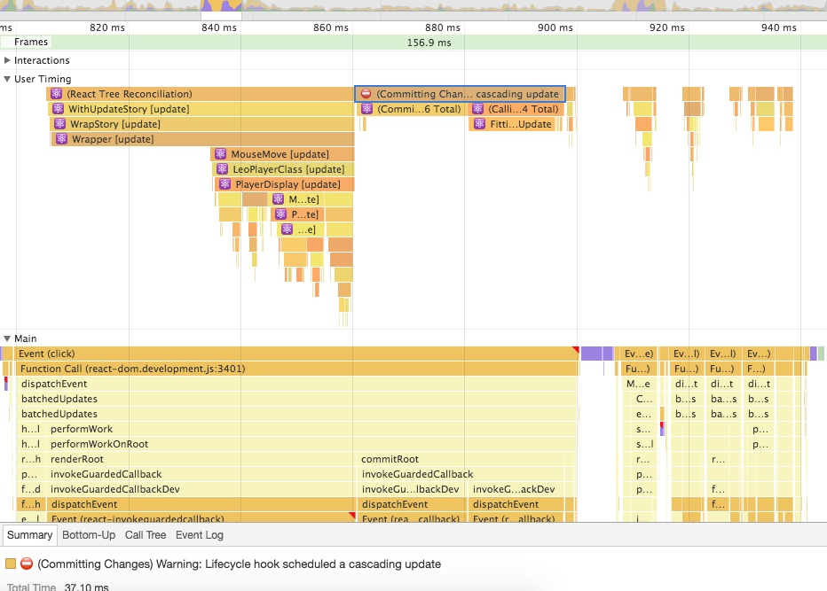
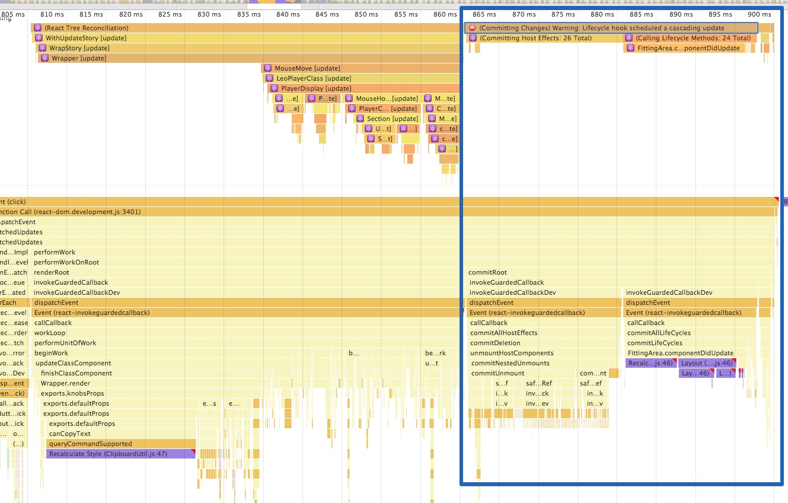
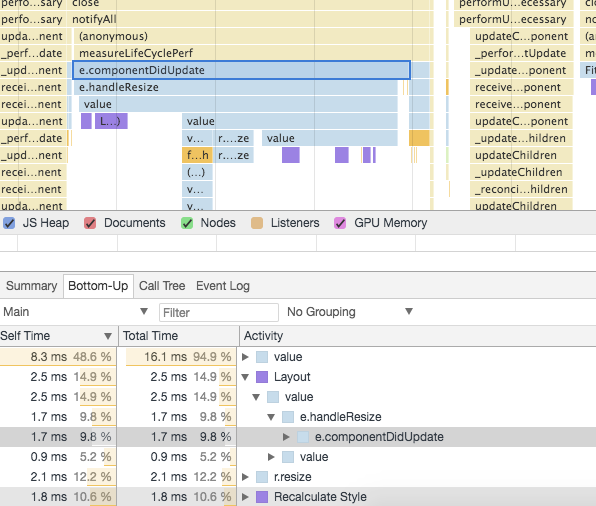
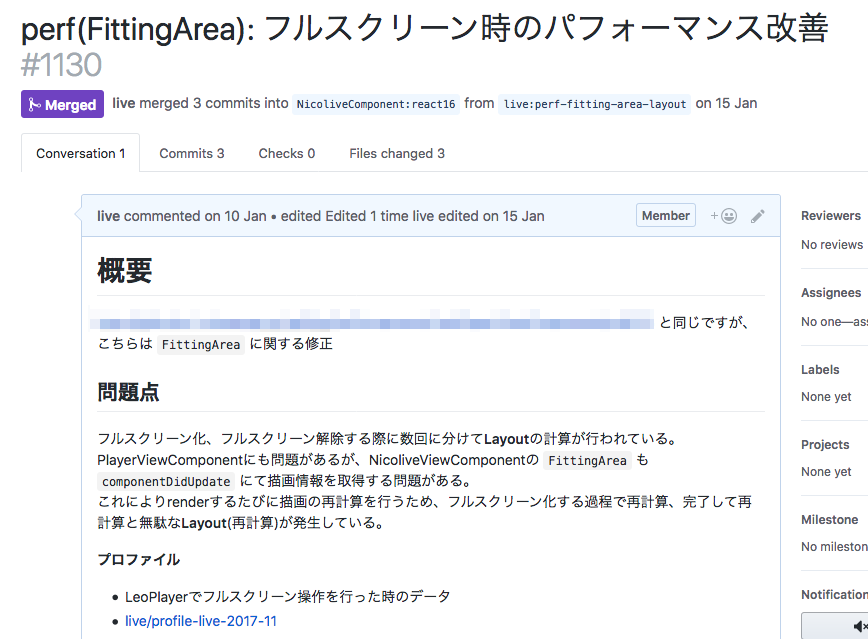
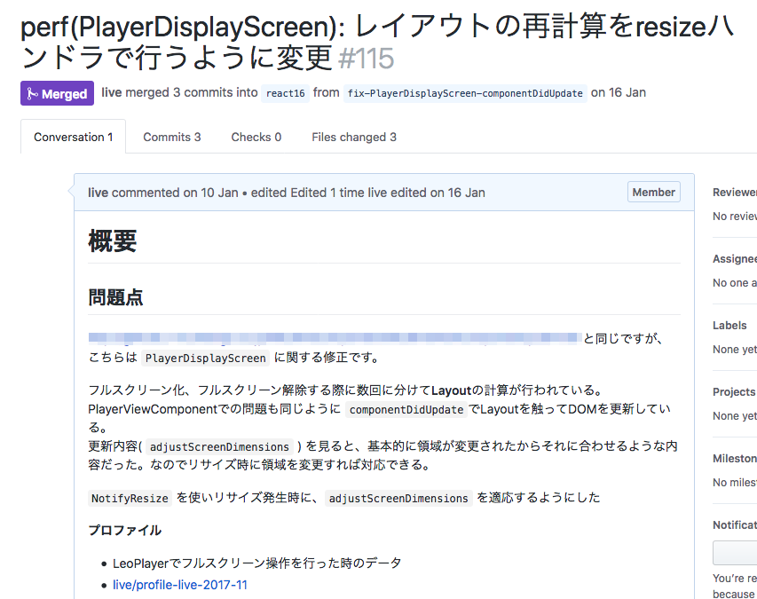

# フルスクリーン時に描画コストの問題の修正

## 観測

プレイヤーのフルスクリーン化、フルスクリーン解除時に音声が途切れることがありました。
どうやら、プレイヤーのフルスクリーン化、フルスクリーン解除時に大きな処理が行われているため、クライアントサイドの映像のデコードが遅れることがあるようだった。

<video src="img/fullscreen.mp4" controls width="640" height="480"></video>

フルスクリーンモードは一般に多くの要素が表示/非表示が切り替わるため負荷が高い処理ということが知られています。

## 問題点

- フルスクリーン化する際に非表示にする要素すべてunmountしている
- フルスクリーン解除する際にunmountした要素をすべてmountしなおしている

これにより、フルスクリーン化/フルスクリーン解除たびにPlayerDisplay（プレイヤーの動画やコントロール部分）以外をすべて再描画するのと同じことがおきていました。

また、要素を再描画する際に、componentDidUpdateでLayoutを行うプロパティを参照しているコンポーネントがいくつかありました。

これは次の問題と同じ原因です。

- [ `componentDidUpdate`でのReflowの修正](../fix-reflow-componentDidUpdate/README.md)

結果として、フルスクリーン時に再描画 ->  再レイアウト -> 再描画 -> 再レイアウトというように描画の負荷が蓄積していることがわかりました。

## おさらい: componentDidUpdateでのレイアウト問題

[componentDidUpdate()](https://reactjs.org/docs/react-component.html#componentdidupdate "componentDidUpdate()")はrender後に呼ばれるライフサイクルメソッドです。
レンダリング後に重たい処理といえば、スクロールや要素のリサイズといったレイアウトを誘発する処理です。

基本的に[componentDidUpdate()](https://reactjs.org/docs/react-component.html#componentdidupdate "componentDidUpdate()")で重たい処理をやるのは向いていないです。
なぜならrenderする度に`componentDidUpdate`は呼ばれるため、不用意なレイアウトを誘発することがあるためです。

そのため、`componentDidUpdate`でレイアウトを行うのではなく、必要なタイミング（イベント）で行うことで最小のコストでレイアウト処理を実装します。

リサイズイベントが起きたから、要素をリサイズするといったようにイベント駆動で処理することで負荷が軽減できます。もちろん大量のイベントが発生すると問題となるため、イベントを間引くや別のタイミングでまとめる工夫も必要になる場合があります。

少なくても、`shouldComponentUpdate`が完全に管理できていない状況においては`componentDidUpdate`でレイアウトするのは問題となりやすい。

- [ `componentDidUpdate`でのReflowの修正](../fix-reflow-componentDidUpdate/README.md)

## componentDidUpdateのLayout問題の見つけ方

`componentDidUpdate`でLayoutが行われているかは開発者ツールのTimelineツールで`componentDidUpdate`の負荷を見ることで調べられます。

具体的な場所は次のような方法で調査しました。

### ボトルネックの見つけ方

#### 1. componentDidUpdateで重たい場所を見つける

React 16ならばTimelineに次のような表示が出ている箇所が怪しい箇所。
長い`componentDidUpdate`の処理の場合に表示される)

> ⛔ (Committing Changes) Warning: Lifecycle hook scheduled a cascading update

- [React 16 : componentDidUpdate Warning: Scheduled a cascading update · Issue #834 · reactjs/react-redux](https://github.com/reduxjs/react-redux/issues/834)
- [React 16 : componentDidUpdate Warning: Scheduled a cascading update · Issue #11987 · facebook/react](https://github.com/facebook/react/issues/11987)
- [performance - React 16 : componentDidUpdate Warning: Scheduled a cascading update - Stack Overflow](https://stackoverflow.com/questions/47599513/react-16-componentdidupdate-warning-scheduled-a-cascading-update)

実際の例:

紫色のLayoutやRecalculate Styleに赤色の警告がでているなら重たい処理です。

> Warning Forced reflow is a likely performance bottleneck.
> Total Time 6.58 ms

実際の処理時間以上に体感に影響を与えることがあります。

#### 2. Reflowを起こしている箇所を見つける

componentDidUpdateで起きてることはわかっているので明白ですが、Timelineの処理時間から逆探知できます。

1. Reflow（紫色）ブロックの親ブロックを選択する
2. "Self Time"でソートする
3. 大体LayoutやRecalculate Styleが上位に来る
4. その中を掘っていくと、`コンポーネント名.componentDidUpdate`が見つかる
5. このコンポーネントがReflowを起こしている直接的な要因です

## 修正

フルスクリーン時にReflowが発生することがわかったため、該当箇所をそれぞれ修正しました。

それぞれ`componentDidUpdate`ではなく、`resize`イベントでレイアウトの再計算を行うようにしました。
こうすることで、描画のタイミングではなく、Resizeのタイミングで再計算を行うので無駄が少なくなりました。

