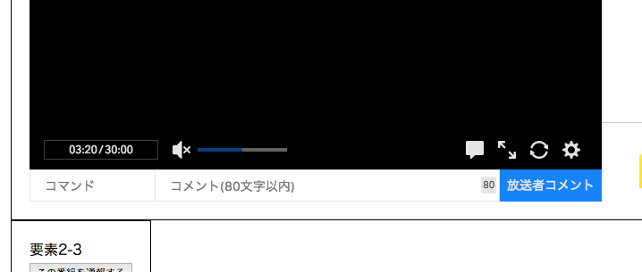
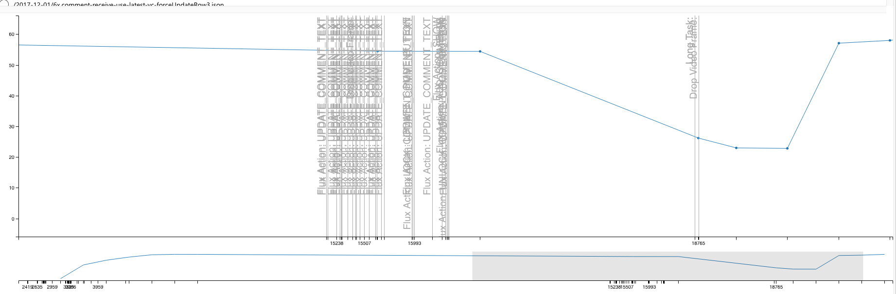

# 入力欄の更新コストの改善

コメントを投稿する入力欄は、文字入力するたびに更新します。
そのため、`<input onChange={更新処理} />` に安易な更新処理を書くととても重たくなる場合があります。

## 観測

視聴ページに主な入力欄は次の2つがあります。

- コメント入力欄
    - 1文字づつユーザーが入力する
- コマンド入力欄
    - コマンドパレットから選ぶ
    - あまり大きな問題にはならない

実際に視聴ページでコメントを入力してみると、かなり広範囲が更新されていることがわかった。
（光っているところが更新されている範囲）

<video src="img/live-input.mp4" controls width="640" height="480"></video>

### 参考

動画の視聴ページにおけるコメント入力の更新範囲。
こちらは、入力ごとに描画が更新される範囲が限定的になっていることがわかります。

<video src="./img/video-input.mp4" controls width="640" height="480"></video>

## 問題

この更新範囲の広さの原因は、コメント欄に1文字入力する度、View全体を更新する処理が走っているためです。

1. FluxのDispatch
2. Storeを更新
2. StoreからView向けのPropsの作成
3. Viewの更新（全体を更新を試みる）

Reactの`input`要素の更新方法には大きく分けて２つあります。

- 常にprops経由で更新するパターン
- コンポーネントのstateに値を持って更新するパターン

問題となっている実装は前者のprops経由でしか更新しないパターンになっていました。

- [Forms - React](https://reactjs.org/docs/forms.html)
- [Uncontrolled Components - React](https://reactjs.org/docs/uncontrolled-components.html)

計測時に取得したパフォーマンスログ:

上記のグラフの例を見ると、コメント入力のイベント（1文字ごとに発生）が発生後にFPSがガクッと下がっていることがわかります。

## 修正方針

修正する方向としては幾つかあります。

1. Viewの中ですべて処理を終わらせる（ViewのStateで入力内容を管理）
    - Controlled Inputs
    - `<input type="text" value={this.state.value} onChange={this.handleChange}/>`
    - 投稿ボタンを押したときにViewから入力内容を取って投稿する
    - これはviewのなかにロジックを書く
2. Viewの更新範囲を限定的にできるような仕組みを作る
3. ContainerからViewのStateを直接操作するOperatorのようなものを作る
  - 具体的には入力欄を更新する `updateText` とか `updateScore` とかそういうのが必要
  - Viewの値(`state`)を半分直接操作できるようにする

ここまでの内容をチームと話し合い、方針`3`で修正することにしました。

- 実際に話し合いで利用したスライド: [コメント入力欄のパフォーマンス問題](./img/input-performance-p.pdf)

## 修正

コンポーネント側がマウントした時に `operator` オブジェクトを取得できるような形にして、`operator.updateText()` や `operator.getValue()` という形で直接更新できる機能を追加しました。
そしてそのコンポーネントを使って入力中は、直接更新するようにし、入力が終わったタイミングで一度全体を更新するような形にしました。

先程の修正方針の**3**と既存のFluxループの仕組みを合わせた形になっています。
これにより、入力中は入力欄だけが更新され、入力が終わったタイミング（debounceして終わったと判断する）でもう一度同期できます。

2種類の更新パターンを使ったハイブリット方式。

1. 入力中: コメント入力欄だけを更新
2. 入力後: 全体を同期させるように更新

こうすることで入力中の負荷の問題とコメントの文字数に応じた動作が解決できます。

## 計測

修正した結果、入力中に更新されるのがコメント入力欄だけに限定されるようになった。

**修正前**

<video src="img/before-comment-input.mp4" controls width="640" height="480"></video>

**修正後**

<video src="img/after-comment-input.mp4" controls width="640" height="480"></video>

## 参考

- [Ah, interesting. – Con Antonakos – Medium](https://medium.com/@conantonakos/ah-interesting-9e7ee51091d1 "Ah, interesting. – Con Antonakos – Medium")
