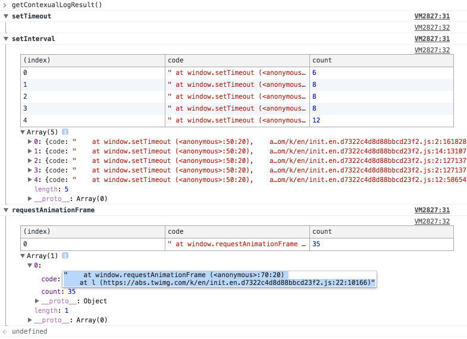
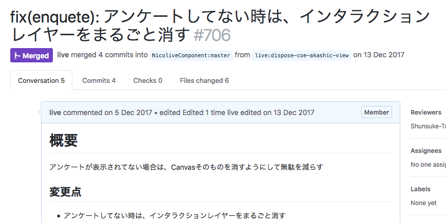

# 定期的に更新されているものを止める

映像を視聴する目的でページを閲覧していると、思っている以上に操作を行うことは少ないです。
そのため、何もしてないときに無駄な処理をしているものがいないかを見つけることは効果があるかもしれません。

ブラウザの多くの処理はイベント駆動なので、何もしてない状態で自動的に処理としてタイマーを使った処理があります。
ブラウザで定期的な処理を行う場合に使われるタイマーは次のものがあります。

- `setTimeout`
- `setInterval`
- `requestAnimationFrame`

これらを監視してみれば、無駄な処理を見つけることができそうです。

別の方法としてChromeにはPerformance Monitorがあるので、これをじっと見ていると変化に気づくことができます。
この問題も元々はPerformance Monitorを見ていて変な処理があることを見つけたのが出発点です。

- [What's New In DevTools (Chrome 64)  |  Web  |  Google Developers](https://developers.google.com/web/updates/2017/11/devtools-release-notes "What&#39;s New In DevTools (Chrome 64)  |  Web  |  Google Developers")

## 観測

次のようなスクリプトを書き、この状態で放置して動いてるタイマーを見つけます。

**参考**

- [ページ上でずっと動いているsetTimeout、setInterval、requestAnimationFrameを見つけてパフォーマンス改善する | Web Scratch](https://efcl.info/2017/12/07/capture-living-timer/ "ページ上でずっと動いているsetTimeout、setInterval、requestAnimationFrameを見つけてパフォーマンス改善する | Web Scratch")

観測していると定期的に動いてるものとして、次のようなものがありました。

- Live Streamの映像取得
- コメントの取得
- コメントの描画
    - Canvasで描画されている
    - `requestAnimation`でメインループを回している
- 番組の状態の取得（視聴数やコメント数）
- アンケート画面の更新処理
    - アンケートはゲームのようなメインループで描画を更新している。
    - そのため`requestAnimation`でメインループを回している

この中で、アンケート画面が表示されていないにもかかわらず、アンケートのメインループ(`requestAnimation`)が動いていることがわかりました。これは無駄な処理といえそうです。

----

## 修正方針

アンケートが非表示にのときにもアンケートのメインループが動いているの問題だった。
原因としては、アンケートがない時は単にCSSで表示を消しているだけに過ぎない状態だった。

そのため、アンケートが行われていない時は、アンケートのプログラムを完全に消すようにすれば修正できそうです。

## 修正

アンケートが行われていない時は、アンケートをDOMからも削除するようにしました。

## 計測

観測で利用したスクリプトを使い、修正後に`requestAnimation`が減っていることが確認できました。

- [ページ上でずっと動いているsetTimeout、setInterval、requestAnimationFrameを見つけてパフォーマンス改善する | Web Scratch](https://efcl.info/2017/12/07/capture-living-timer/ "ページ上でずっと動いているsetTimeout、setInterval、requestAnimationFrameを見つけてパフォーマンス改善する | Web Scratch")
