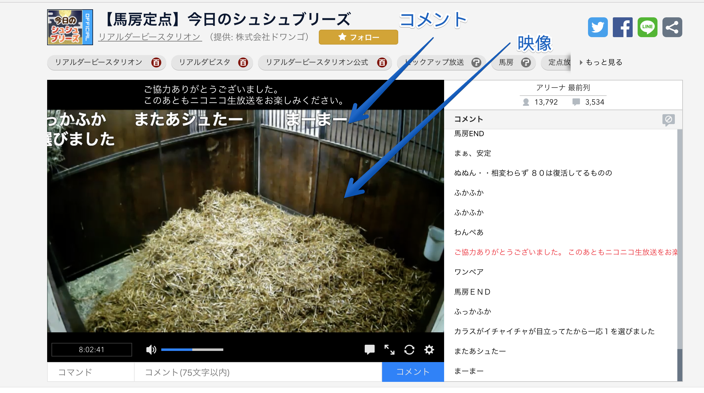

# ライブラリを改善する

ニコニコ生放送（PC）では生放送の映像を再生するため[hls.js](https://github.com/video-dev/hls.js)を利用しています。
[hls.js](https://github.com/video-dev/hls.js)はHLSに非対応ブラウザ（ChromeやFirefoxなど）でもHLSを再生するためのライブラリです。

HLS自体については次のサイトなどを見てください。

- [HTTP Live Streaming (HLS) - Apple Developer](https://developer.apple.com/streaming/ "HTTP Live Streaming (HLS) - Apple Developer")
- [HLSについて知っていることを話します](https://www.slideshare.net/moriyoshi/hls-46107808 "HLSについて知っていることを話します")
- [フロントエンドエンジニアのための動画ストリーミング技術基礎 | ygoto3.com](https://ygoto3.com/posts/streaming-technology-basics-for-frontend-engineers/index.html "フロントエンドエンジニアのための動画ストリーミング技術基礎 | ygoto3.com")

[指標について](../metrics/README.md)でも書いていますが、視聴ページのメインコンテンツは映像、映像の上に描画するコメントです。



`hls.js`はこの映像を再生に利用するため、`hls.js`のパフォーマンスはそのまま視聴ページのパフォーマンスや安定性に繋がります。

ここではまず`hls.js`のパフォーマンスを分析し、改善できる点がないかを探すことにしました。

## 関数プロファイル

[hls.js](https://github.com/video-dev/hls.js)は[Media Source Extensions](https://developer.mozilla.org/en-US/docs/Web/API/Media_Source_Extensions_API)（MSE）というAPIを利用し映像を再生します。
`hls.js`ではこのMSEに渡せるように、映像を取得、デコードまた映像のバッファをチェックするといった処理が行われています。

`hls.js`の処理はDOM APIにほとんど依存してない（一部Web Workerなどがあります）処理なので、そのままJavaScriptコードのプロファイルを取ればボトルネックが見えてきそうです。

ブラウザの開発者ツールでもプロファイルを取れますが、開発者ツールだと他のコードなどもまざってしまいノイズが多くなってしまいました。
そこで、[node-sjsp](https://github.com/45deg/node-sjsp)を少し改変して`hls.js`のコードだけのプロファイルを取れるようにしたものを使いました。

- [45deg/node-sjsp: sjsp (Simple JavaScript Profiler) implemented in Node.js](https://github.com/45deg/node-sjsp)

コードも一部改変しましたが、次のような`node-sjsp`を使ってコード変換できる[webpack](https://webpack.js.org/)のLoaderを書きました。
このLoaderを特定のパス(`hls.js`)のパスだけに適応すれば、特定のコードだけの関数プロファイルがコンソールに出力されます。

```js
"use strict";
const inject = require("node-sjsp").inject;
const path = require("path");
const currentDir = __dirname
module.exports = function (jsCode, inMap) {
    var filepath = path.relative(currentDir, this.resourcePath);
    var injectedCode = inject(filepath, jsCode, 10);
    return injectedCode;
};
```

実際に取得した`hls.js`の関数ごとのプロファイルを見てみてみます。


合計の処理時間順に並べてるとイベントの仕組みやメインループでの`tick`、バッファチェックなどが大部分を占めていることがわかります。

- `EventEmitter`
- `tick` （バッファのチェックなどをして正しく再生できているかを100msごとにチェックする）
- `_checkAppendedParsed`（バッファが断片化してないかをチェックする）

それぞれの`tick` 1回の処理は数ミリ秒などとても小さいですが、
`hls.js`の仕組み上どこかで数百ミリ秒の処理が発生すると、それは映像がそこで止まるということを意味します。
そのため、常に安定した時間で処理を回し続けることが大切であるという認識です。

## 不要な処理を無効化

他にも`node-sjsp`を使っていろいろな状況でプロファイルを取っていると、`Cea608`という見慣れない処理が出てくることがありました。


[CEA-608](https://en.wikipedia.org/wiki/EIA-608)はキャプション（字幕）のことです。
字幕がない動画に対してもこの処理が行われているため、なにか無駄な処理を行っていそうです。

`hls.js`のソースコードやドキュメントを見ると[enableCEA708Captions](https://github.com/video-dev/hls.js/blob/master/docs/API.md#enablecea708captions)というオプションで字幕処理を無効化できることがわかります。
（これらはデフォルトが有効です）

この[enableCEA708Captions](https://github.com/video-dev/hls.js/blob/master/docs/API.md#enablecea708captions)オプションを`false`にすることで`Cea608`に関する処理をしなくなることが確認できました。

📝 hls.jsではこのオプションが有効時にフラグメントを取得するたびに、`cea608Parser`をリセットする処理が行われていました。

- <https://github.com/video-dev/hls.js/blob/905e65fd68095bd5e2bc9f888ae09b64fca8835a/src/controller/timeline-controller.js#L228-L232>

## `hls.js`を修正する

関数のプロファイルを見てみると`hls.js`で処理の中心となっているのは高頻度が呼ばれる`tick`や`_checkAppendedParsed`などでした。
これらの処理は高頻度で呼ばれるため、少しでも改善すると映像再生の安定化に寄与するだろうと仮説がありました。
また、`_checkAppendedParsed`などは保持しているフラグメントの数（HLSは映像がセグメント単位に細かく切ったものを取得し再生します）と処理時間に相関がありそうでした。
実際に `fragments` という配列に対して、forループでチェック処理を行うため、フラグメントの数が増えると処理時間が増加していました。


> フラグメント数と`_checkAppendedParsed`の処理コストの相関

これらのパフォーマンスを改善するには`hls.js`そのものに手を入れる必要があるため、`hls.js`にPull Requestして修正するようにしました。

さきほどの`_checkAppendedParsed`の問題もループ内の処理を最適化するPRを出すなどして、マイクロベンチ上は3.38倍早くなりました。


> [Improve `StreamController#_checkAppendedParsed` performance #1528](https://github.com/video-dev/hls.js/pull/1528)

これに加えて[バッファチェックの仕組みの構造を修正](https://github.com/video-dev/hls.js/issues/1544)するといった改善も行っています。

また`hls.js`は複雑なステートをもつコードですが、それに対してテストの量が足りていなかったのでテストを追加したり、
SauceLabを使った[CIが不安定だったのを問題を安定化](https://github.com/video-dev/hls.js/issues/1566)するなどを行いました。

最終的には数十のコミットやPull Requestをした結果、`hls.js`のコラボレータとして活動しています。

## ForkではなくPull Request

[hls.js](https://github.com/video-dev/hls.js)のパフォーマンス改善を行う場合に、Pull Requestを送るのではなくForkしてしまうという選択肢もありました。
しかしながら、`hls.js`は十分複雑なライブラリです。そのため安易にForkすると、Upstreamに追従するのも難しくメンテナンスコストが高くなりやすいです。

- [Living Downstream - BOF vFinal.key](http://llvm.org/devmtg/2015-10/slides/RobinsonEdwards-LivingDownstreamWithoutDrowning.pdf)
    - SonyがLLVMのForkをやめた話

<!-- textlint-disable -->

これは`hls.js`に限らずさまざまなOSSを使った開発で発生する問題です。
あるライブラリを利用する際には、そのライブラリに問題が発生したときにどうするかを考えてから選択しても遅くはないかもしれません。

<!-- textlint-enable -->
