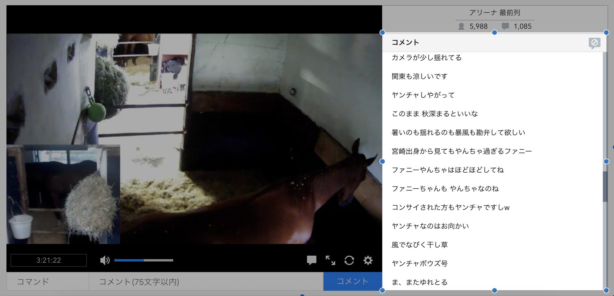
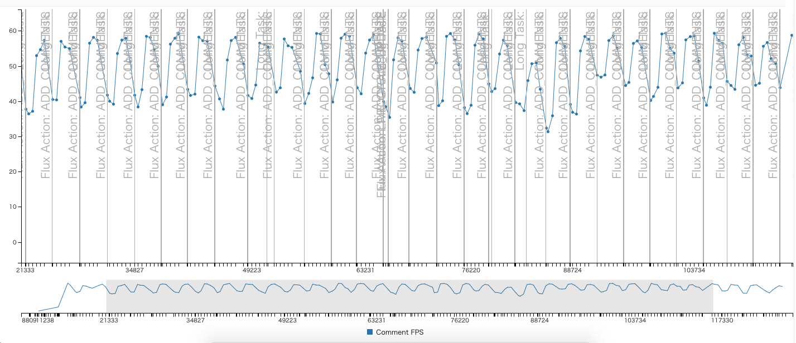

# リストコンポーネントの修正

リストコンポーネントは多くの要素を扱う性質上レンダリングのボトルネックとなりやすいです。

生放送の視聴ページにもコメントパネルと呼ばれるリストを扱うコンポーネントがあります。

低スペックのデバイスでは、このリストコンポーネントにコメントを追加する処理が定常的に時間がかかっていることが観測できていました。

[指標](../metrics/README.md)で作成したパフォーマンスログをみた結果、コメントを追加(`ADD_COMMENT`のFluxログ)が起きる度に、コメントのCanvasのFPSが下がっていることがわかります。

FPSの急激な変化は体感が悪いため、コメント（アイテム）をコメントパネル（リスト）に追加する時の処理は改善するべき項目だと判断できます。（緩やかな変化が望ましい）

リストコンポーネントは最適化のために表示範囲の要素だけを描画する仕組みなどがすでに実装されていました。

- [バーチャルレンダリング](https://speakerdeck.com/anatoo/virtual-rendering-introduction "バーチャルレンダリング")
- [Webフロントエンド ハイパフォーマンス チューニング](http://gihyo.jp/book/2017/978-4-7741-8967-3 "Webフロントエンド ハイパフォーマンス チューニング")

そのような処理の軽減があっても、コメントを追加する度に数十個の要素が追加/削除されてたりしているため、スペックの低いデバイスではボトルネックとなります。

何か原因で処理が重くなっているのかを調べつつ、それらを修正していきます。
