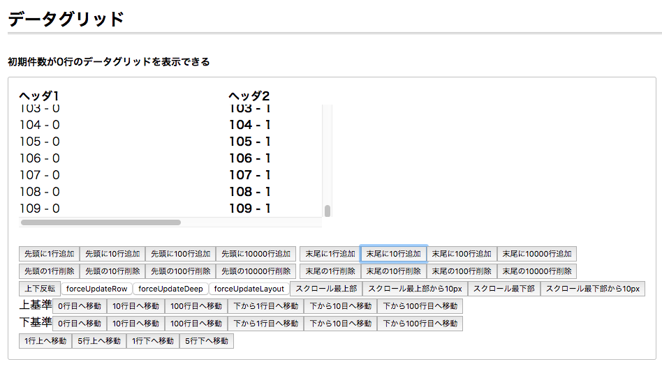
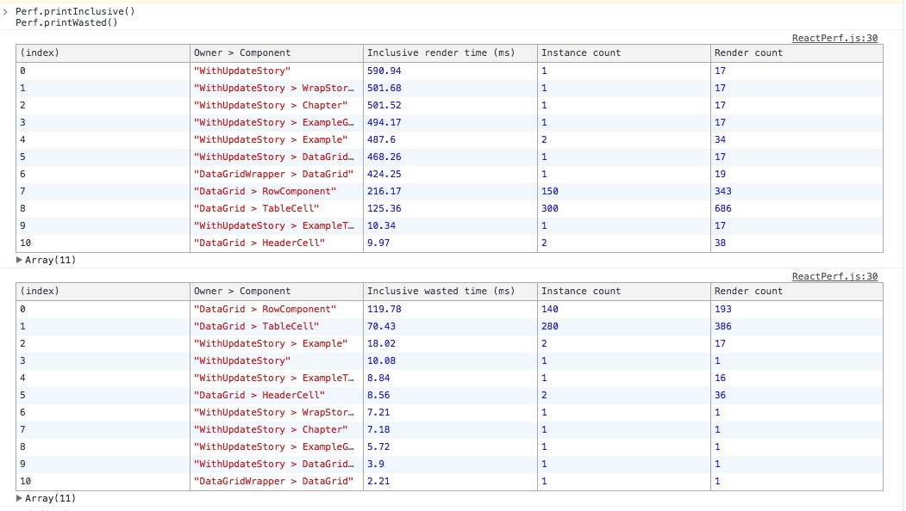
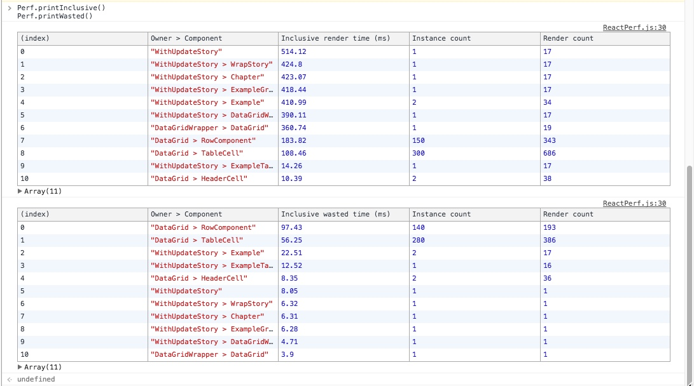
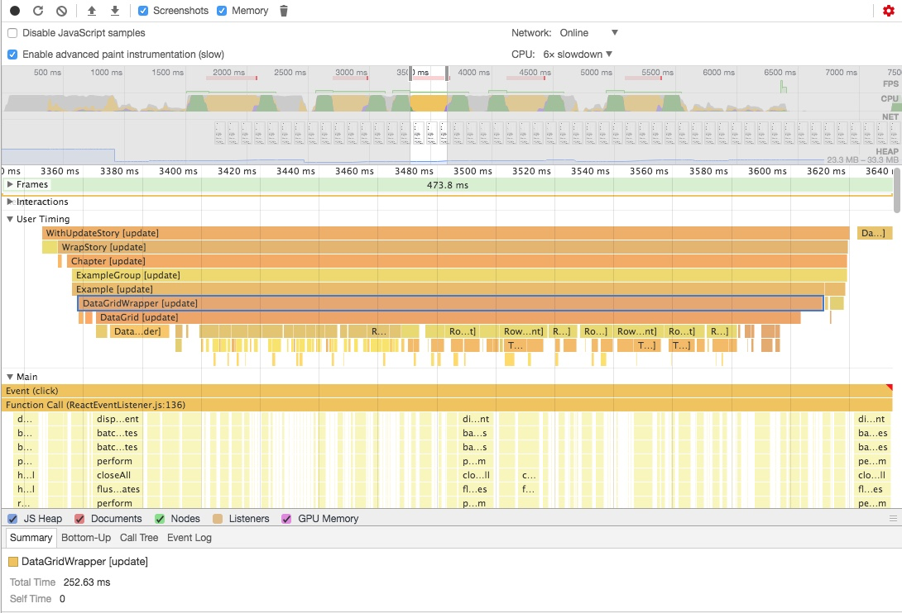
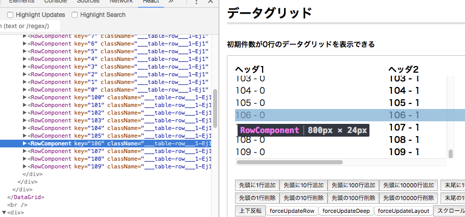
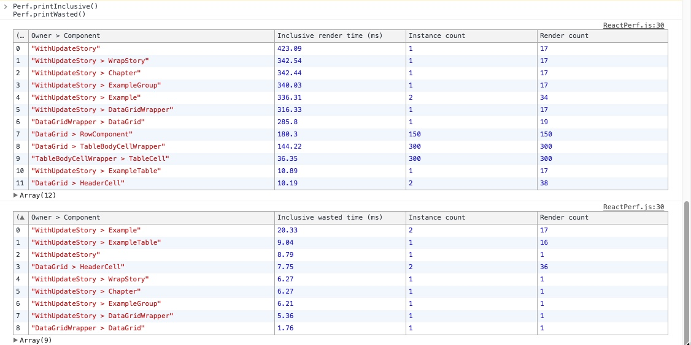
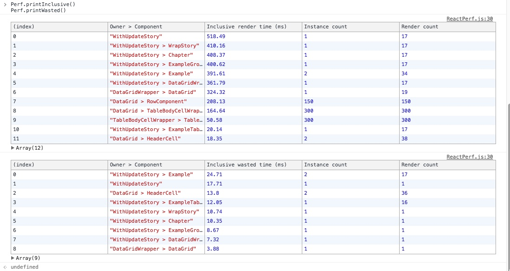
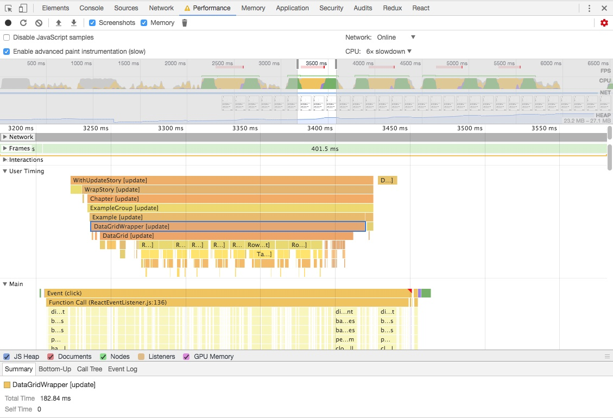

# リストコンポーネントの`shouldComponentUpdate`の改善

コメントパネルは`DataGrid`と呼ばれる汎用的なリスト表示のコンポーネントで作られていました。

`DataGrid`は次のように1行ごとにアイテムを並べ、表示領域の上下の見えない空間は空のdiv要素を配置して高さを作るといった作りになっています。

## DataGrid

次の動画のように`DataGrid`にコメントを追加すると、表示範囲外の描画も発生していることが分かると思います。


<video src="img/datagrid-highlight.mp4" controls width="640" height="480"></video>

これは高さを確保するための仕組みなので意図とおりです。
しかし、リストはリストアイテムの更新する時の処理を小さくできればそのまま `リストアイテムの数 * 改善した時間`分だけ処理時間が減ります。
そのため、リストアイテムそれぞれの最適化をするモチベーションは大きいです。

## 観測

リストコンポーネントに無駄な処理がないかを詳しく調べるために、`react-addons-perf`を使って無駄な更新が行われていないかを調べてみることにしました。

> **注記:**
> `react-addons-perf`はReact 15でしか動きません。
> React 16以降は[react-performance](https://github.com/amsul/react-performance "react-performance")や[公式のプロファイラ](https://reactjs.org/blog/2018/09/10/introducing-the-react-profiler.html)を利用します。

- [Performance Tools - React](https://reactjs.org/docs/perf.html)
- [Reactを使ったプロダクトのパフォーマンスを改善した話 | GMOメディア エンジニアブログ](http://tech.gmo-media.jp/post/141458071484/react-perf-tuning)

`react-addons-perf`には[printWasted()](https://reactjs.org/docs/perf.html#printwasted "printWasted()")という、無駄な更新をテーブル表示してくれる機能があります。ここでいう無駄な更新というのは、Propsなどが同じrender結果が同じであったためVirtual DOMに吸収され結局何も変わらなかった更新のことを言います。

再現性がある操作で再現性がある結果を得るために、まずはどういう操作をした時の処理を記録するかを考えました。
`DataGrid`はコンポーネント単位で開発されていて[Storybook](https://github.com/storybooks/storybook "storybook")というプレビュー環境で動かすことができるようになっていました。
そのため、このStorybookで特定の操作をした時の動作を観測していきました。



> StorybookでのDataGrid

### 操作内容

DataGridの典型的なユースケースはコメントを追加することであるため、次の操作をした時の処理を`react-addons-perf`で記録しました。

1. DataGridのStoryで10コずつコメントを末尾に追加する
2. これを15回繰り返す
3. ReactPerfAddonで計測結果を出す
    - `printWasted()` の Wasted Time が必要がない更新にかかっている時間

### （改善前）計測結果

1回目

2回目


#### プロファイル結果

合わせてタイムラインツールでプロファイル結果を記録しました。



一度（10個追加）のDataGridのupdateにかかっている時間

- 252.63 ~ 300ms


### 結果から分かること

`RowComponent`という`DataGrid`の内のコンポーネントが無駄に更新されていることがわかります。（90-110ms程度が無駄になっている）
`RowComponent`は、リストのリストアイテムのコンポーネントでした。



何が無駄なのかを具体的に調べてみると、次のことがわかりました。

- DataGridにコメントを追加する時、既存の`RowComponent`は再利用できるはず
- 実際には`RowComponent`は再利用されずに、追加のたびに同じpropsで再描画されていた

この`RowComponent`コンポーネントの無駄な描画を減らせば`無駄な行数 * コスト`が削減できることになります。

## 修正方針

無駄な再描画が起きないように同じpropsなら同じコンポーネントの結果を返せるように`shouldComponentUpdate`を正しく実装してあげればよさそうです。
リストのように巨大な配列がpropsに入る可能性がある場合は必ずshallow equalのような浅い比較で済むように気をつける必要があります。
そうしないと`shouldComponentUpdate`自体の処理が重くなってしまって意味がなくなります。

**参考**:

- [shallow-equal for Object/React props | Web Scratch](https://efcl.info/2017/11/30/shallow-equal/ "shallow-equal for Object/React props | Web Scratch")

## 修正

`DataGrid`では、関数をpropsとして受け取り、その関数が`RowComponent`を作るという仕組みなっていました。
簡略化すると次のようなコンポーネントを返す関数を受け取り、内部でその関数を実行して`RowComponent`が作られています。

```js
// `RowComponent`を作る関数
const generateRowComponent = (rowInfomation) => {
    return <RowCompoment {...rowInformation} />
}
// DataGridにその関数をわたす
<DataGrid generateRowComponent={generateRowComponent} />
// .. DataGridの中では ...
class DataGrid extends React.Component{
    render(){
        const アイテムの情報一覧 = this.props.アイテムの情報一覧;
        const items = アイテムの情報一覧.map(アイテム情報 => {
            return this.props.generateRowComponent(アイテム情報);
        });
        return <ul>
            {items}
        </ul>
    }
}
```

`RowComponent`を使いまわすようにキャッシュしたいのが目的であるため、
`generateRowComponent`が同じ引数なら同じ結果を返すようなメモ化をすれば解決できます。

```js
const memorizedGenerateRowComponent = memorize(generateRowComponent)
// DataGridにメモ化した関数をわたす
<DataGrid generateRowComponent={generateRowComponent} />
```

しかし、できるだけReactの動作フローで解決したかったので、`generateRowComponent`が返すコンポーネントをラップした`React.Component`を作ることにしました。
次のように`generateRowComponent`の関数をラップし、同じPropsなら同じ結果がキャッシュされるようにしました。

```
// `RowComponent`を作る関数
const generateRowComponent = (rowInfomation) => {
    return <RowCompoment {...rowInformation} />
}
// DataGridにその関数をわたす
<DataGrid generateRowComponent={generateRowComponent} />
// ここまでは同じ
// .. DataGridの中では ...
// generateRowComponentをラップしキャッシュできるコンポーネントを作る
class WrapperRowComponent extends React.Component{
    shouldComponentUpdate(nextProps){
        // ここでpropsの判定を正しくやればWrapperRowComponentは使いまわされる
    }
    render(){
        // 渡されたgenerateRowComponent()からコンポーネントを作って返す
        reuturn this.props.generateRowComponent(this.props.アイテム情報);
    }
}
class DataGrid extends React.Component{
    render(){
        const アイテムの情報一覧 = this.props.アイテムの情報一覧;
        const items = アイテムの情報一覧.map(アイテム情報 => {
            return <WrapperRowComponent アイテム情報={...アイテム情報} generateRowComponent={this.props.generateRowComponent} />
        });
        return <ul>
            {items}
        </ul>
    }
}
```


## 計測

修正前と同じ手順で`react-addons-perf`を記録しました。

1回目

2回目


**Wasted Time**から`RowComponent`が消えて、無駄な更新がなくなっていることがわかります。

### プロファイル



一度（10個追加）のDataGridのupdateにかかっている時間

- **150~220ms**

修正前に比べると更新処理が100ms程度改善していることがわかります。

- Before: **250~300ms**
- After: **150~220ms**
