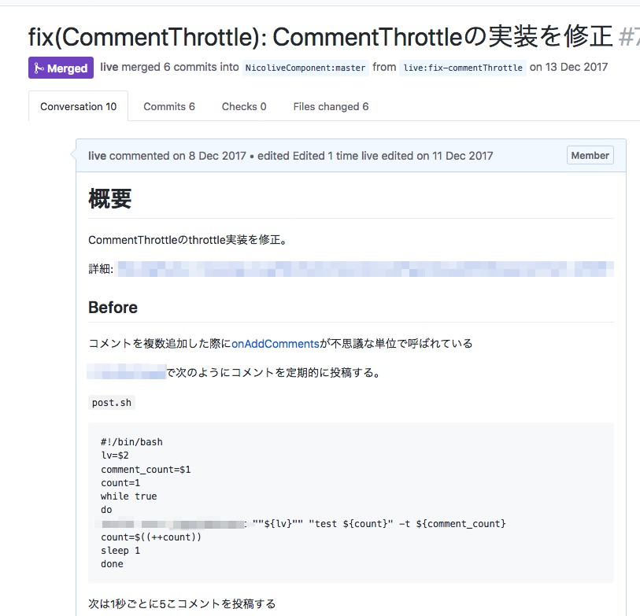

# リストコンポーネントへの追加処理の修正

[リストコンポーネントの`shouldComponentUpdate`の改善](./shouldComponentUpdate.md)でリストコンポーネントの更新処理自体は改善されています。
しかし、リストコンポーネントにリストアイテム（コメント）を追加する回数や頻度が多いと更新処理自体は改善されていても更新回数が増えます。

更新回数を減らすには、コメントを追加するタイミングを間引くような仕組みが必要です。
実はすでに、`CommentThrottle`とそのままの名前のthrottlingで間引く処理の実装が使われていることがわかりました。

## 観測

このthrottlingの最適値を調べるつもりで、1秒ごとに5コのコメントを追加してその動きを調べてみました。

- 1秒ごとに5コのコメントを追加したとき
   - `onAddComments`は 4、1の引数で2回呼ばれる
- 1秒ごとに10コのコメントを追加した時
   - `onAddComments` は9、1の引数で2回呼ばれる
- 1秒ごとに2コのコメントを追加した時
   - `onAddComments` は 1、1 の引数で2回呼ばれる

なぜか2回に分けてコメントが追加されていることがわかりました。
一度に追加するコメント数を変えても `n -> 1` と2回に分けられています。

これは`CommentThrottle`の実装が何かおかしそうです。

## 修正の方針

意図した挙動は、Nミリ秒間にMコのコメントを追加したら、その後Mコのコメントが同時にリストコンポーネントに追加されるです。

まずは、その挙動になっているかテストするために`CommentThrottle`のテストコードを書くとよさそうです。

```js
describe("CommentThrottle", () => {
    describe("コメントを一度も追加してない時", () => {
        it("intervalをまってもflushされない", () => {
            // テスト実装
        });
    });
    describe("コメントを追加した時", () => {
        it("追加しても同期的にはflushされない", () => {
            // テスト実装
        });
        it("追加したコメントはFLUSH_INTERVALまでflushされない", () => {
            // テスト実装
        });
        it("追加したコメントはFLUSH_INTERVAL後flushされる", () => {
            // テスト実装
        });
        it("複数のコメントを追加した場合は、FLUSH_INTERVAL後にまとめてflushされる", () => {
            // テスト実装
        });
        it("シナリオテスト", () => {
        });
    });
});
```

このテストを実装してみると、既存の`CommentThrottle`はバグがあることがわかりました。
（意図した挙動のテストが通らない）

## 修正

まずは、テストが通るように無理やり`CommentThrottle`を修正しました。
その後、テストが通るのを維持したまま実装を書き換えて問題を修正しました。



## 計測

テストが通るので大きな問題ないと思いますが、計測前に行った仕組みと同じ方法で呼び出す回数を記録しました。

- 1秒ごとに5コのコメントを追加したとき
   - `onAddComments`は 5の引数で1回呼ばれる
- 1秒ごとに10コのコメントを追加した時
   - `onAddComments` は10の引数で1回呼ばれる
- 1秒ごとに2コのコメントを追加した時
   -`onAddComments` は 2の引数で1回呼ばれる

意図したとおりになっているので問題ありませんでした。

既存の実装が存在していても、その実装が意図したように動いているかは試してみないとわかりません。
実際に数値として出してみれば、実装が正しいかは分かるはず。

テストを書いたほうが結果的にコストが低い場合もあります。そのためテストを書いて試してみるのも大切です。
