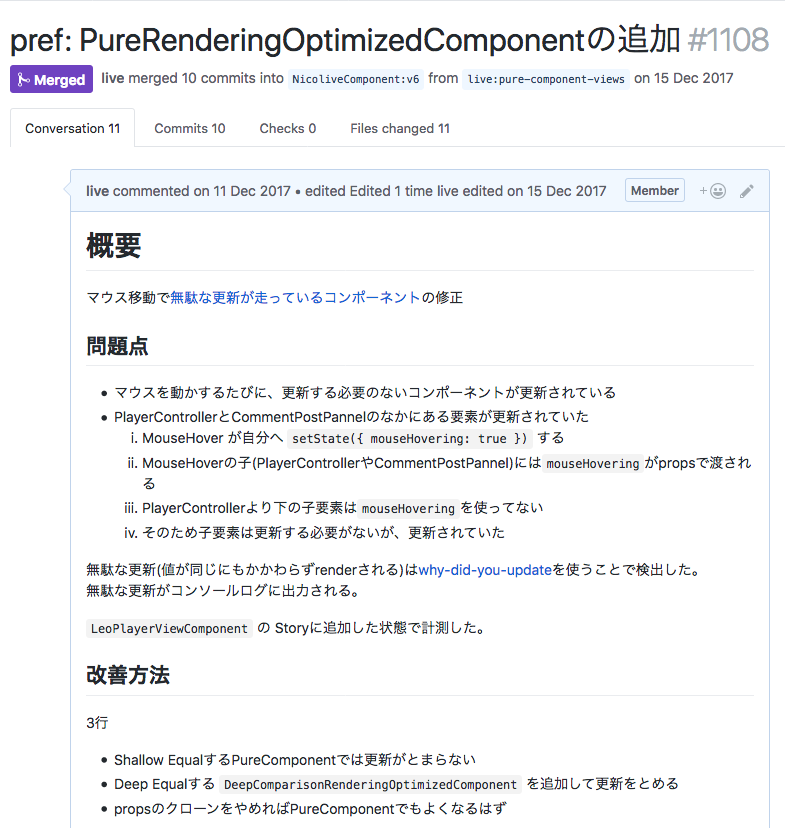

# マウスを動かすと再描画する問題の修正

PCブラウザでもっと多く発生するイベントは`MouseMove`や`Scroll`であることが多いです。
そのため、これらのイベントを監視して更新処理をする時は慎重にならないといけません。

これらの頻度が高いイベントを軽減する方法としてdebounceや`Intersection Observer`などの新しいAPIがあります。

- [Debouncing and Throttling Explained Through Examples | CSS-Tricks](https://css-tricks.com/debouncing-throttling-explained-examples/)
- [入力ハンドラのデバウンス  |  Web  |  Google Developers](https://developers.google.com/web/fundamentals/performance/rendering/debounce-your-input-handlers?hl=ja)

そもそもの問題として、そのイベントで何も変化する必要がないならばその更新処理を止めるべきです。

## 観測

視聴ページで、マウスを移動をすると載せただけで更新されるコンポーネントが幾つかあることがわかりました。

[facebook/react-devtools](https://github.com/facebook/react-devtools "facebook/react-devtools")の"Highlight Updates"を使うことで更新されているコンポーネントが点滅します。

<video src="img/mouse-move-highlight.mp4" controls width="640" height="480"></video>

マウス移動で何か表示が変わっているのなら、それは意図した挙動なので問題ありません。
しかし、表示が変わっていないにもかかわらず更新処理（点滅）を行っているならばそれは無駄といえます。

[why-did-you-update](https://github.com/maicki/why-did-you-update "why-did-you-update")を使うことで、無駄な更新処理なのかを確認してみました。
次のような感じでReactをラップすると、無駄な更新をコンソールに表示してくれます。

```js
import * as React from "react";
if (process.env.NODE_ENV !== "production") {
    const { whyDidYouUpdate } = require("why-did-you-update");
    whyDidYouUpdate(React);
}
```

ここでの"無駄な更新"とは、全く同じ値（Props）なのに更新(`render`)されている処理のことを言います。

- [why-did-you-update](https://github.com/maicki/why-did-you-update "why-did-you-update")
    - 無駄な更新をコンソールに出力してくれる
    - たとえばあるアクションにおいて無駄なレンダリングが起きてるかを調べるときに使う
- [react-addons-perf](https://www.npmjs.com/package/react-addons-perf "react-addons-perf")（React 15限定）
    - “Wasted” time がwhy-did-you-updateと似た感じ
    - 一覧できるので分かりやすい
    - アプリを起動時や色んな操作をした結果の統計を見るのに使う
- [react-performance](https://github.com/amsul/react-performance "react-performance")
    - React 16対応
    - 開発中

[why-did-you-update](https://github.com/maicki/why-did-you-update "why-did-you-update")を入れた状態でマウス移動を行う特定のコンポーネントがコンソールログに表示されました。

<video src="img/before-mousehover.mp4" controls width="640" height="480"></video>

合わせてコメント欄周辺をマウス移動した時のプロファイルを取ってみます。


先ほどの[why-did-you-update](https://github.com/maicki/why-did-you-update "why-did-you-update")との出力と合わせてみると、`Form`コンポーネントの下にある、`Input`や`Button`や`Field`といったコンポーネントが無駄に更新されていることがわかります。

## 問題

次のコンポーネントが同じPropsを受け取ったにもかかわらず更新されているのが問題です。

- `Input`
- `Button`
- `Field`

実装を見ると`React.Component`を継承していて、かつ`shouldComponentUpdate`が実装されていませんでした。

```jsx
export class Field extends React.Component {}
```

この場合はPropsが変わるたびに更新されます。

## 修正方針

`shouldComponentUpdate`を実装して、前回と同じPropsなら更新しないようにすれば解決できそうです。

### Note

この問題の修正のために独自の`DeepComparisonRenderingOptimizedComponent`という親コンポーネントを使っています。（既存の構造の問題があったため）
通常のケースではReactが提供している`React.PureComponent`のShallow（浅い）な比較で十分でしょう。

Shallowな比較と、Deepな比較の違いについては次の記事で解説しています。

- [shallow-equal for Object/React props | Web Scratch](https://efcl.info/2017/11/30/shallow-equal/ "shallow-equal for Object/React props | Web Scratch")

## 修正

該当するそれぞれのコンポーネントに`shouldComponentUpdate`を実装を追加しました。



## 計測

### Before

マウスを動かすと[why-did-you-update](https://github.com/maicki/why-did-you-update "why-did-you-update")のログがでています。

<video src="img/before-mousehover.mp4" controls width="640" height="480"></video>


### After

マウスを動かしても無駄な更新されるコンポーネントはなくなりました。
[why-did-you-update](https://github.com/maicki/why-did-you-update "why-did-you-update")のログが出なくなった)

<video src="img/after-mouse-hover.mp4" controls width="640" height="480"></video>


具体的には、`Form`まで`update`処理が止まっていることがプロファイルからわかります。
つまり、`Form`次のコンポーネントにおいて`shouldComponentUpdate`により更新が不要と判断され、`update`処理が行われなくなっていることを意味します。

- `Input`
- `Button`
- `Field`


