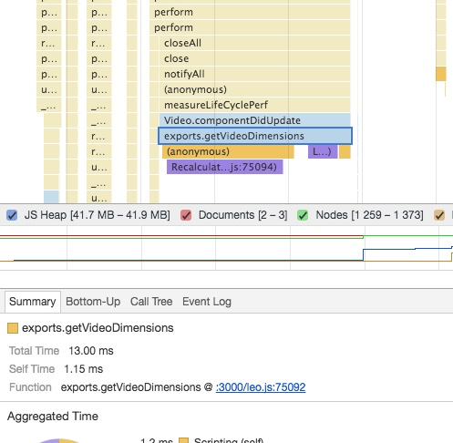
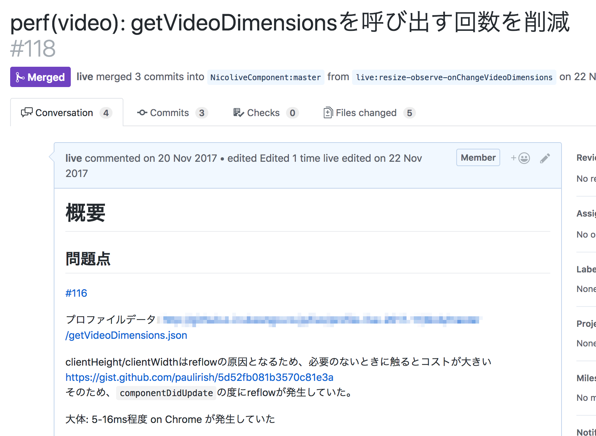

# `componentDidUpdate`でのReflowの修正

Reactではコンポーネントが描画/更新し終わると`componentDidUpdate`のライフサイクルメソッドが呼ばれます。
このとき、`componentDidUpdate`でReflowが発生するということは、描画が更新されるたびにレイアウト情報を計算し直さなければなりません。

> レイアウトの算出 各要素に割り当てられたスタイル情報をもとに、それぞれの要素がどの ような位置関係で配置されるのかを決定するのがレイアウトの算出処理で す。これが行われないと、要素がどんな位置にどんな大きさで配置されて いるのかはわかりません。
> この処理の呼称はレンダリングエンジンによっ て異なります。Chrome の Blink や Safari の WebKitではこの処理を単にレイアウト(Layout)と呼び、Firefox の Gecko ではリフロー(Reflow)と呼びます が、本書ではレイアウトの算出と総称します。 
> JavaScript から Element#getBoundingClientRect() メソッドを実行して要素の矩形情報を取得したり、offsetTop や offsetWidth などのプロパティを 参照したりすることは頻繁にあります。
> これらもレイアウトの算出処理に よって得られた値を取得するための API です。このようなレイアウトに関わる情報の更新や参照がJavaScriptから頻繁に行われることでレイアウト 算出の処理が誘発され、UI のスムーズさを損なう大きい負荷を生み出してしまうことがあります。
> [超速！ Webページ速度改善ガイド](http://gihyo.jp/book/2017/978-4-7741-9400-4 "超速！ Webページ速度改善ガイド")

ペイント（描画）とレイアウトは多くのブラウザでは、レンダリングプロセスでそれぞれ別々の処理となっています。
表示内容は変わっていても（ペイントはされても）、表示サイズといった枠組（レイアウト）は変わっていない場合などは、レイアウトはする必要がありません。

## `live-video-component`

生放送では`live-video-component`という`Video`要素のラッパーコンポーネントを使っています。

### 観測

動画をずっと見ていると、動画が詰まって詰まったときのローディングアイコンがでるととても重たくなる現象を観測しました。

実際にそのタイミングでタイムラインツールのプロファイルを記録してみました。

このときにプロファイルを見てみると、`Video`コンポーネントの`componentDidUpdate`でレイアウトの再計算が発生していることに気づけます。



13msのうち殆どを占めている処理で1Frame分（16ms）程度かかっているので体感できる程度のカクツキがおきていました。

### 問題

このコンポーネントが`componentDidUpdate`で、Reflowを起こしているため、些細な更新であっても、重たいレイアウト処理が同時に発生しています。

このレイアウト処理の原因は`getVideoDimension`にあることはタイムラインからもわかります。

```js
/**
 * 実際に表示される映像領域の寸法情報を取得
 */
export const getVideoDimensions = (video: HTMLVideoElement): VideoDimensions => {
    const aspectRatio = video.videoWidth / video.videoHeight;
    const elementWidth = video.clientWidth; // widthは%が入ってくることがあるのでpxが取れるclientWidthを使う
    const elementHeight = video.clientHeight;
    const elementRatio = elementWidth / elementHeight;
    const displayWidth = elementRatio > aspectRatio ? elementHeight * aspectRatio : elementWidth;
    const displayHeight = elementRatio < aspectRatio ? elementWidth / aspectRatio : elementHeight;
    return {
        videoWidth: video.videoWidth,
        videoHeight: video.videoHeight,
        aspectRatio: aspectRatio,
        displayWidth: displayWidth,
        displayHeight: displayHeight
    };
};
```

`getVideoDimensions`の中で、`clientHeight`/`clientWidth`など要素のサイズを再計算が必要なDOMプロパティに触れていることがわかります。

これらのプロパティはレイアウトを発生させるプロパティとして知られています。
次のページのそれらのプロパティのまとめられています。

- <https://gist.github.com/paulirish/5d52fb081b3570c81e3a>
- [CSS Triggers](https://csstriggers.com/ "CSS Triggers")

このプロパティを`componentDidUpdate`で参照しないようにできればこの問題は修正できます。

### 修正方針

この`getVideoDimensions`の用途はVideoコンポーネントのサイズが外的要因で変化した時に、サイズを取得して追従するために利用していたようでした。コンポーネントが更新されるたびに、サイズを取得しているというのが主な問題です。
コンポーネントの更新とコンポーネントのサイズが変わるかは別であるため、サイズ変化のイベントを監視して追従すべきです。

ブラウザのDOM APIには要素のサイズを変化を検知する方法があります。
そのため、描画更新の度(`componentDidUpdate`)にレイアウトの再計算を行うよりも、そのイベントに反応してレイアウトを計算する方が効率的です。

**Note:**

要素の大きさの変化を見るなら、[ResizeObserver](https://developers.google.com/web/updates/2016/10/resizeobserver "ResizeObserver")ですが、まだ策定段階のAPIです。

- [ResizeObserver](https://developers.google.com/web/updates/2016/10/resizeobserver "ResizeObserver")

[4.2 Element Resize Detection](https://arxiv.org/pdf/1511.01223v1.pdf)には既存のAPIを使って要素のサイズ変化を検知する方法がまとめらています。

## 修正



具体的には次のような修正を行いました。

<!-- textlint-disable -->

- `componentDidUpdate`で`getVideoDimensions`をしていたのは、ブラウザフルにおいて要素のサイズの追従が必要かどうかのためだった
- つまり、要素のサイズが変わったタイミングで`onChangeVideoDimensions`を呼び出すことができれば`componentDidUpdate`から、`getVideoDimensions`の呼び出しを削除することができる
- [`react-notify-resize`](https://www.npmjs.com/package/react-notify-resize "react-notify-resize")を使い、要素のリサイズ時に`getVideoDimensions`を呼び出す実装に変更した


<!-- textlint-enable -->

## 計測

修正後、Videoコンポーネントに渡すpropsを変化させた時のタイムラインプロファイルを取り、Videoコンポーネントの更新時にReflowが発生しなくなったことを確認できた。

