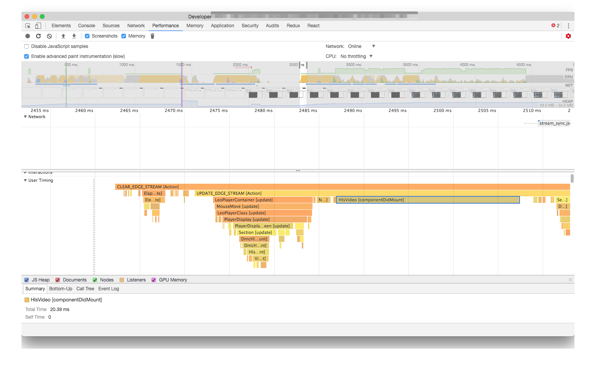

# パフォーマンスの計測の仕方

> 計測できないなら安易に直さない

パフォーマンスの計測の仕方はさまざまです。
計測方法はボトルネックとなる部分（ネットワークやレンダリングといった箇所）によって異なります。

計測方法も大事ですが、計測する環境も重要です。

## スロットリング

開発に使うようなマシンはハイスペックです。
パフォーマンスの計測を行う際は、必ずCPUスロットリングなどのスロットリングを行った状態で一度計測するべきです。

- CPUスロットリングを行う
    - `6x` 6倍遅い状態
- ネットワークスロットリングを行う

## 実際に利用した設定

この**視聴中のパフォーマンス改善**では次のような設定を利用して計測しています。
ネットワークスロットリングについてはランタイムではあまり関係ないものが多かったため特に設定していませんでした。

- 値の計測: Chrome
    - CPUスロットリング: 6x
    - ネットワークスロットリング: なし
- 動作の確認: IE/Edge/Firefox/Chrome/Safari

**参考**

- [CPU Throttling - Chrome DevTools - Dev Tips](https://umaar.com/dev-tips/88-cpu-throttling/)
- [さまざまなネットワーク状態でのパフォーマンスの最適化  |  Tools for Web Developers  |  Google Developers](https://developers.google.com/web/tools/chrome-devtools/network-performance/network-conditions?hl=ja)
- [モバイル開発に役立つJSデバッグ術 - Mercari Engineering Blog](https://tech.mercari.com/entry/2017/12/13/103000)

また、Chromeのネットワークスロットリングはリクエストレベルのスロットリングになります。そのためパケットレベルのスロットリングをする場合は別のツールを使ったほうが安定します。

- [lighthouse/throttling.md at master · GoogleChrome/lighthouse](https://github.com/GoogleChrome/lighthouse/blob/master/docs/throttling.md "lighthouse/throttling.md at master · GoogleChrome/lighthouse")

## 実機確認

映像のデコードなどハードウェアの機能を使うものほど実機で確認するべきです。
VMのWindowsでは再現しないが、実機では再現するといった違いなどが発生します。

## 計測ツール

- [Chrome DevTools](https://developers.google.com/web/tools/chrome-devtools/?hl=ja "Chrome DevTools")
    - もっとも多機能で大部分をカバーできます
- [`about:tracing`](https://www.chromium.org/developers/how-tos/trace-event-profiling-tool "The Trace Event Profiling Tool (about:tracing) - The Chromium Projects")
    - グラフィックや入力レイテンシーなどレベルに近い情報を見られます
    - [パフォーマンス計測に困らない！tracing活用術100 - Qiita](https://qiita.com/keishi/items/5f1af0851901e9021488 "パフォーマンス計測に困らない！tracing活用術100 - Qiita")
- ライブラリのデバッガ
    - 最近のライブラリにはたいていデバッガが着いています
    - [facebook/react-devtools: An extension that allows inspection of React component hierarchy in the Chrome and Firefox Developer Tools.](https://github.com/facebook/react-devtools "facebook/react-devtools: An extension that allows inspection of React component hierarchy in the Chrome and Firefox Developer Tools.")
- `performance.mark`、`performance.measures`
    - [User Timing API: あなたの Web アプリをもっと理解するために - HTML5 Rocks](https://www.html5rocks.com/ja/tutorials/webperformance/usertiming/)
    - [パフォーマンスまわりのAPIについて - Qiita](https://qiita.com/makotot/items/70bd392a62afd43d3189)
    - [User Timing API - Web APIs | MDN](https://developer.mozilla.org/en-US/docs/Web/API/User_Timing_API)

## User Timing API

User Timing APIと呼ばれるものには`performance.mark`、`performance.measures`などがあります。
これらは、自分で指定した範囲をマーキングできます。
閲覧中（視聴中）のパフォーマンスというのは、機械的に取ることが難しいです。

そのため、`performance.mark`、`performance.measures`を使ってアプリケーションに適した「指定範囲」を作ることがパフォーマンスの計測に役立ちます。

[指標](../metrics/README.md)で作成したパフォーマンスログもこれらのAPIを使っています。

- [performance.markでパフォーマンス計測する | Web Scratch](https://efcl.info/2016/08/15/performance.mark/ "performance.markでパフォーマンス計測する | Web Scratch")
- [performance.markにメタデータを紐付けできるライブラリを書いた | Web Scratch](https://efcl.info/2017/11/15/performance.mark-metadata/)
- [`performance.mark` with metadata is useful for Real user monitoring](https://dev.to/azu/performancemark-with-medata-is-useful-for-real-user-monitoring-54p)

また、最近はFluxやReduxなどイベントを発火してViewを更新するスタイルを取っていることが多いと思います。
イベントが起点となっているときの利点として、何のイベントによって表示が更新されたかという関連付けが簡単なところにあります。

生放送の視聴ページでは[flux](https://github.com/facebook/flux "flux")と[React](https://reactjs.org/ "React")が使われていました。

この２つならイベント（FluxのDispatch）と表示の更新（Reactのrender）を関連付けて可視化することは簡単です。
VueやAlminなど最近のライブラリなら大抵何とかなります。

- [Almin + React/Vue.jsのパフォーマンスプロファイルをタイムライン表示できるように | Web Scratch](https://efcl.info/2017/09/20/almin-performance-profile-0.14.0/ "Almin + React/Vue.jsのパフォーマンスプロファイルをタイムライン表示できるように | Web Scratch")

### イベントと更新の可視化

[flux](https://github.com/facebook/flux "flux")のイベントと[React](https://reactjs.org/ "React")の更新の関係をUser Timing APIを使って可視化してみましょう。

といっても難しい話ではなく、Fluxがdispatchしたタイミングで`performance.mark`を貼り、Storeが更新されたタイミングもう一度`performance.mark`を貼るだけです。
Reactは`?react_perf`（React 16からはデフォルト）を付けるだけど、自動的に`performance.mark`をつけてくれます。

- [Profiling Components with the Chrome Performance Tab](https://reactjs.org/docs/optimizing-performance.html#profiling-components-with-the-chrome-performance-tab "Profiling Components with the Chrome Performance Tab")

FluxのDispatchの実装は次のような形にしました。

`Dispatcher`のシングルトンを作るときにUser Timingの処理を追加
```ts
import * as flux from "flux";
/**
 * アクションを発行した際に受け渡す情報.
 */
export interface ActionPayload {
    type: string;
}

/**
 * アクションを発行するもの.
 */
export const Dispatcher = new flux.Dispatcher<ActionPayload>();

/**
 * 開発向けのFluxのDispatchロガー
 *
 * - Fluxでdispatchしたアクションをコンソールへ出力
 * - タイムラインツールにアクションの実行を記録
 *  - 正確な実行時間は記録できないのであくまで参考
 *  - 実行時間はdispatchしてから次のrequestFrameAnimationが起きるまでの時間が記録されている
 *
 * URLに`?react_perfを付けることでActionとViewの処理の関係をタイムラインツールでみることができる
 *
 * - https://developers.google.com/web/tools/chrome-devtools/evaluate-performance/timeline-tool?hl=ja
 * - https://reactjs.org/docs/optimizing-performance.html#profiling-components-with-the-chrome-performance-tab
 *
 * 無効化する方法:
 *
 * 以下の環境変数と共に起動することで無効化される(production時は自動で無効化される)
 *
 * DISABLE_FLUX_LOG=1 npm start
 *
 */
if (process.env.NODE_ENV !== "production" && process.env.DISABLE_FLUX_LOG !== "1") {
    let requestAnimationFrameId: number | null = null;
    // 同期的に複数のPayloadが来ることがあるので貯める
    let currentPendingPayloads: ActionPayload[] = [];
    Dispatcher.register((payload: ActionPayload) => {
        // 1. performance.markの計測開始
        performance.mark(payload.type);
        if (requestAnimationFrameId) {
            cancelAnimationFrame(requestAnimationFrameId);
        }
        currentPendingPayloads.push(payload);
        // 現在はStoreのDispatcherTokenを取る方法がないため、非同期でちょっとだけ待つことで変化したStore一覧を取得している
        requestAnimationFrameId = requestAnimationFrame(() => {
            currentPendingPayloads.forEach(payload => {
                const type = payload.type;
                // 2. performance.markの計測終了
                const measureMark = `${type} [Action]`;
                performance.measure(
                    measureMark,
                    payload.type
                );
                // 計測に使ったmarkは削除する
                performance.clearMarks(type);
                performance.clearMeasures(measureMark);
            });
            currentPendingPayloads = [];
            requestAnimationFrameId = null;
        });
    });
}
```

これで、FluxがdispatchしたらそのActionの名前がChromeのタイムラインツールで見れます。
後は、[Timeline ツール](https://developers.google.com/web/tools/chrome-devtools/evaluate-performance/timeline-tool?hl=ja "Timeline ツール")で単純に記録するだけで、「どのアクション」によって「どのコンポーネント」が更新されているかが可視化できます。



問題の糸口を探すには情報の可視化が大切です。

## 情報量の削減

Chromeの開発者ツールは情報量が多いため、逆に何が重要なのかがわからなくなる問題もあります。
そのような場合は、フィルタリングを工夫するか必要な情報だけを出すログツールを自分で書くのが簡単です。

大げさな仕組み化をしなければ既存の機能を乗っ取ったりしてログを得ることはできるはず。
この際に、エコシステムが大きなライブラリはそのようなツールもすでにあることが多いという利点があります。

Reactではさまざまなツールがありますが、必要に応じて使い分けることが大切です。

- [why-did-you-update](https://github.com/maicki/why-did-you-update "why-did-you-update")
- [react-addons-perf](https://www.npmjs.com/package/react-addons-perf "react-addons-perf")（React 15限定）
- [React Performance Devtool](https://github.com/nitin42/react-perf-devtool "React Performance Devtool")（React 16対応）
- [amsul/react-performance: Helpers to debug and record component render performance 🚀](https://github.com/amsul/react-performance)
- [nitin42/react-perf-devtool: A Chrome developer tool extension to inspect performance of React components.](https://github.com/nitin42/react-perf-devtool)

CPUプロファイラを自作する例

- [シンプルでかつ最高のJavaScriptプロファイラ sjsp を作りました！ ― Webアプリケーションが複雑化する中でプロファイラに求められるものとは何か - プログラムモグモグ](https://itchyny.hatenablog.com/entry/2015/07/01/120000 "シンプルでかつ最高のJavaScriptプロファイラ sjsp を作りました！ ― Webアプリケーションが複雑化する中でプロファイラに求められるものとは何か - プログラムモグモグ")
- [45deg/node-sjsp: sjsp (Simple JavaScript Profiler) implemented in Node.js](https://github.com/45deg/node-sjsp "45deg/node-sjsp: sjsp (Simple JavaScript Profiler) implemented in Node.js")

Video要素やhls.jsのイベントを調べるツール

- [azu/video-events-debugger: [WIP] HTML5 Video element events debugging tools.](https://github.com/azu/video-events-debugger "azu/video-events-debugger: [WIP] HTML5 Video element events debugging tools.")
