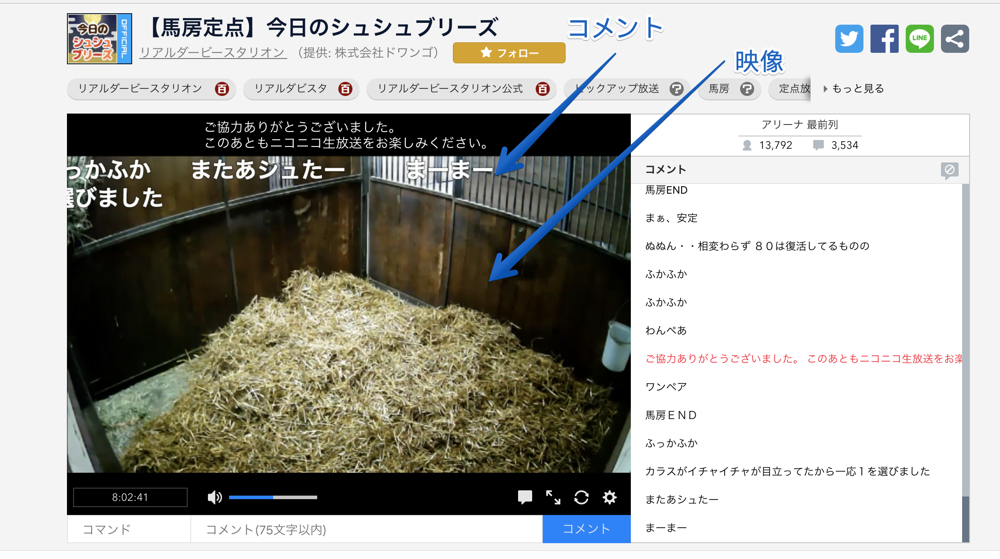
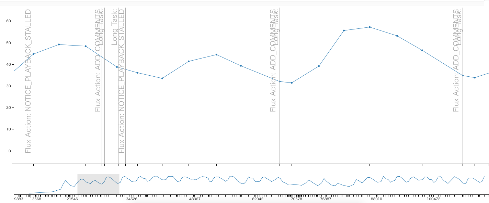

# 指標

ページロードのパフォーマンスではなく、視聴ページを閲覧中（視聴中）のランタイムのパフォーマンスであるため指標を決めるのが難しい問題があります。

ページロードに関する指標として機械的に取れるものも多く、[SpeedCurve](https://speedcurve.com/ "SpeedCurve: Monitor front-end performance")や[Calibre](https://calibreapp.com/ "Calibre")などのサービスも対応しています。

- [Web クライアントサイドのパフォーマンスメトリクス — Speed Index、Paint Timing、TTI etc... ::ハブろぐ](https://havelog.ayumusato.com/develop/performance/e744-performance_metrics.html)
- [Leveraging the Performance Metrics that Most Affect User Experience  |  Web  |  Google Developers](https://developers.google.com/web/fundamentals/performance/user-centric-performance-metrics)

これに対して、ページロード後の閲覧中（視聴中）におけるパフォーマンスの指標はアプリケーションに依存するため明確なものがあまりありません。

今回は簡単な指標と計測のツールを作ることにしました。

## 指標を作る

視聴ページのメインコンテンツは映像、映像の上に描画するコメントです。
そのためどちらかを軸にして、指標とするのが良さそうです。

何度か観測していると、映像が追いついていない時はコメントもカクカクしていることが多いに気づきました。
コメント表示にはCanvasで描画する`comment-renderer`というモジュールを使っています。
そのため、コメントがカクカクしているかは`comment-renderer`からFPSを取得すれば機械的に取得できます。

### コメントのFPS

ChromeのCPUスロットリングで6倍遅い状態にしてみると、些細な操作でコメントがカクカクしていることがわかっていました。
コメントがカクカクしてくると映像がとまり（Stalledを引き起こす）ローディングが表示されることも多いことがわかりました。

閲覧中（視聴中）に常に変化のある値の方が指標としては分かりやすいので、コメントのFPSを指標としてみることにしました。
映像がカクカクしているかは技術的に取得することが難しかったという問題もあります（Stalledの回数などは取れるが、それだと0か1になって極端）。

通常60FPSでコメントをレンダリングできますが、処理が重くなってくると30FPSを切って見た目的にもカクカクしてきます。
このFPSの高く保つことができるようになれば、閲覧中がある程度快適に行えていると判断できます。

## 指標

コメントのFPSを縦軸にし、時間経過でそのFPSがどのように変化しているかを関連付ければ、何が原因（イベント）でFPSが低下しているかもわかりそうです。

パフォーマンスの測定を行うときにはその測定処理自体が重くなることがあるので、`performance.mark` APIをベースに、コメントのFPSとイベントのデータを計測する処理を実装しました。

具体的な実装方法やライブラリについては次の記事で解説しています。

- [performance.markにメタデータを紐付けできるライブラリを書いた | Web Scratch](https://efcl.info/2017/11/15/performance.mark-metadata/)
- [`performance.mark` with metadata is useful for Real user monitoring](https://dev.to/azu/performancemark-with-medata-is-useful-for-real-user-monitoring-54p)

具体的に実装したものは次のとおりです。

- [x] コメント描画のFPS
  - 概要: コメントを描画するレンダラーのFPS（Frame Per Seconds）
- [x] 映像を再生するVideo要素の `VideoPlaybackQuality`
  - 概要: [VideoPlaybackQuality](https://developer.mozilla.org/ja/docs/Web/API/VideoPlaybackQuality "VideoPlaybackQuality")は再生時にDropしたフレーム数を取得できる
- [x] 映像の再生詰まりの回数
  - 概要: 映像取得が再生に追いついていないときにローディング表示がでている回数と同義
- [x] [Long Tasks API 1](https://w3c.github.io/longtasks/ "Long Tasks API 1")の回数
  - 概要: 50ms以上かかっている処理。Chromeのみ

### 指標のログデータ

これらのデータを**パフォーマンスログデータ**と呼ぶことにして、定期的に計測したものを貯めておくことにしました。
このパフォーマンスログデータの変化を見れば、パフォーマンスが改善しているのかの判断材料の1つとなりそうです。
（これらのパフォーマンスログデータ特定のリポジトリに追加していきました）

ログデータは単なるJSONファイルで、それだとモチベーションが湧きにくい/わかりにくいため、簡単なビューアアプリを書いてそれを見られる状態にしました。

> 縦軸がコメントのFPSで、横軸は時間軸

定期的にイベントが発生して、FPSに変化を与えていることがわかります。

## 📝 RUMの信頼性

視聴中における体験を良くするのが目的なので、指標は明確に定めることが難しいです。
視聴中に継続的に取る値として次の項目を取得し、その傾向を参考程度にしかならない。
環境に左右されやすいRUM（Real User Measurement）なので、強く判断材料にはしにくいです（データ量がある程度必要）。

そのため、結局はボトルネックとなっているところを明確に見つけてそこに関するマイクロな改善を重ねることで、最終的な目的を達成する必要があります。

RUMと異なりSynthetic Monitoringといった環境が固定され定点できる手法ならば、ブレが起きにくいのでより指標に向いています。
一方、閲覧中（視聴中）の指標として扱うのが難しいです。

- [計測の種類 - Catchpoint | 株式会社Spelldata](https://spelldata.co.jp/catchpoint/monitoring_type.html "計測の種類 - Catchpoint | 株式会社Spelldata")

## 📝 [RAIL](https://developers.google.com/web/fundamentals/performance/rail?hl=ja "RAIL")モデル

何かした時に反応が100ms以内、アニメーションが10ms以内、アイドル時の処理は50ms以上以内のブロックにする（long task）、Loadは1000ms以内などを指標を定めた[RAIL](https://developers.google.com/web/fundamentals/performance/rail?hl=ja "RAIL")モデルなどがあります。

